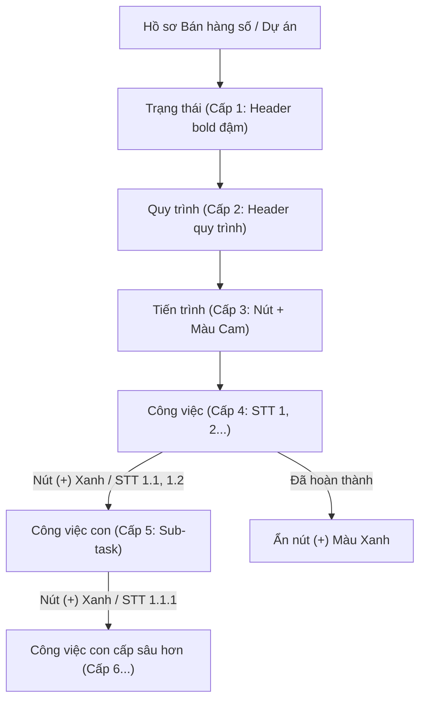
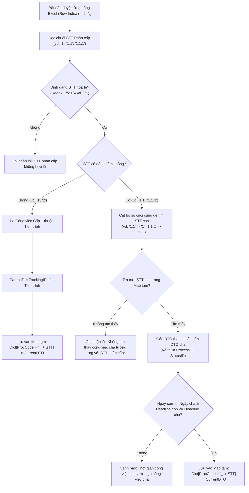

# PRODUCT BACKLOG: TÍNH NĂNG TẠO CÔNG VIỆC CON BÊN TRONG CÔNG VIỆC & NÂNG CẤP IMPORT PHÂN CẤP (MULTI-LEVEL SUB-TASKS & HIERARCHICAL IMPORT)

Tài liệu Product Backlog kỹ thuật chuẩn Agile/Scrum đặc tả chi tiết 2 yêu cầu nghiệp vụ trọng tâm:
1. **Xây dựng thêm việc tạo công việc con bên trong công việc; trên mỗi dòng công việc chưa hoàn thành có 1 nút Thêm (+) màu xanh để tạo thêm công việc con.**
2. **Cập nhật tính năng và mẫu file Excel Import công việc, bổ sung cột "STT Phân cấp" theo định dạng `1`, `1.1`, `1.1.1` để nhận biết và thiết lập chính xác quan hệ công việc cha - công việc con.**

---

## 1. TỔNG QUAN & BỐI CẢNH HỆ THỐNG (SYSTEM OVERVIEW)

### 1.1. Hiện trạng phân cấp Checklist trước đây
Hệ thống CRM CenIT TOC quản lý phân cấp 4 tầng:
$$\text{Trạng thái (Cấp 1)} \longrightarrow \text{Quy trình (Cấp 2)} \longrightarrow \text{Tiến trình (Cấp 3)} \longrightarrow \text{Công việc / Todo list (Cấp 4)}$$

- **Dòng Tiến trình (Cấp 3):** Có nút Thêm (+) màu cam (`btn-add-todo`) để tạo Công việc (Todo list) trực thuộc tiến trình cha (`ParentID = Tiến trình`).
- **Dòng Công việc (Cấp 4):** Là lá cuối cùng (leaf node), chưa có khả năng tạo tiếp công việc con bên trong để phân rã nhiệm vụ chi tiết.
- **Tính năng Import công việc hiện tại:** File Excel chỉ hỗ trợ import phẳng 1 cấp vào Tiến trình (`ParentID = Mã tiến trình`). Không thể hiện được cấu trúc cha - con giữa các công việc với nhau.

### 1.2. Mục tiêu nâng cấp (Enhanced Multi-level Hierarchy & Hierarchical Import)
1. **Mở rộng kiến trúc Checklist thành mô hình cây phân cấp đa tầng (Multi-level Tree):**
   $$\text{Trạng thái (1)} \longrightarrow \text{Quy trình (2)} \longrightarrow \text{Tiến trình (3)} \longrightarrow \text{Công việc (4)} \overset{\text{Nút (+) Xanh}}{\longrightarrow} \text{Công việc con (5)} \overset{\text{Nút (+) Xanh}}{\longrightarrow} \text{Việc con cấp sâu hơn (6...)}$$
2. **Nâng cấp toàn diện mẫu & bộ xử lý Import Excel:** Bổ sung cột **STT Phân cấp WBS (`1`, `1.1`, `1.1.1`)**, tự động xây dựng cây quan hệ cha - con nhiều cấp, kiểm tra ràng buộc thời hạn và lưu trữ phân tầng an toàn (Level-Order Insertion).



---

## 2. QUY TẮC THIẾT KẾ UI/UX (USER INTERFACE SPECIFICATIONS)

### 2.1. Nút Thêm (+) Màu Xanh trên Dòng Công Việc Chưa Hoàn Thành
- **Vị trí hiển thị:** Đặt ngay phía sau Tên công việc, cạnh Badge số lượng việc con (nếu có).
- **Điều kiện hiển thị:**
  - Người dùng có quyền chỉnh sửa (`canEdit == true`).
  - Hồ sơ đang ở trạng thái hiện tại (`isCurrentStatus == true`).
  - **Dòng công việc chưa hoàn thành (`task.Status != 3`):** Bắt buộc hiển thị nút Thêm (+) màu xanh.
  - **Khi công việc đã hoàn thành (`task.Status == 3`):** Ẩn hoàn toàn nút Thêm (+) màu xanh (chỉ hiển thị nút Mở khóa/Log).
- **Quy chuẩn màu sắc & Style CSS (`.btn-add-subtask`):**
  - Tránh nhầm lẫn với nút (+) màu cam của Tiến trình cha (`#ea580c` / `#ffedd5`).
  - Sử dụng **Tone xanh lá (Green / Emerald)** thể hiện hành động tạo mới việc con nhánh:
    ```css
    .btn-add-subtask {
        display: inline-flex;
        align-items: center;
        justify-content: center;
        width: 22px;
        height: 22px;
        border-radius: 50%;
        color: #15803d;
        background-color: #dcfce7;
        border: 1px solid #bbf7d0;
        font-size: 0.85rem;
        transition: all 0.2s ease-in-out;
        margin-left: 6px;
        vertical-align: middle;
        cursor: pointer;
    }
    .btn-add-subtask:hover {
        background-color: #16a34a;
        color: #ffffff;
        border-color: #16a34a;
        transform: scale(1.15);
        box-shadow: 0 2px 5px rgba(22, 163, 74, 0.35);
        text-decoration: none;
    }
    ```

### 2.2. Hiển thị Cây Công Việc Đa Tầng trên Bảng Checklist Grid
- **Thụt lề cây (Indentation):** 
  - Cấp 4 (Công việc trực thuộc tiến trình): `padding-left: 48px;`
  - Cấp 5 (Công việc con của việc cấp 4): `padding-left: 72px;`
  - Cấp 6 (Công việc con của việc cấp 5): `padding-left: 96px;`
- **Ký hiệu nhánh cây trực quan:** Dùng ký hiệu `└─` và `│   └─` màu xám nhạt (`#94a3b8`), font monospace để phân biệt rõ bậc cha - con.
- **Mã công việc con:** Sinh mã tiền tố chuẩn `CV + YY + MM + XXXXXXX` với badge viền xanh ngọc hoặc xanh dương nhạt (`bgc-info-l4 text-info-d2 border-1 brc-info-m3`).
- **Đóng/Mở nhánh cây (Fold/Unfold):** 
  - Khi một công việc có các công việc con bên trong, hiển thị badge số lượng (Ví dụ: `[1/3 việc con]`).
  - Click vào badge hoặc icon thu gọn để ẩn/hiện toàn bộ danh sách việc con trực thuộc.

---

## 3. GIẢI PHÁP KỸ THUẬT & QUY TRÌNH IMPORT CÔNG VIỆC PHÂN CẤP (WBS IMPORT ENGINE)

### 3.1. Cấu trúc Mẫu File Excel Mới (`Mau_Import_CongViec_{QuyTrinh}_{yyyyMMdd}.xlsx`)
File Excel mẫu tải về bao gồm **2 sheet**:

#### 📊 Sheet 1: Dữ liệu Công việc (Data Sheet)
Bổ sung cột đầu tiên là **`STT Phân cấp (*)`**:

| Cột A | Cột B | Cột C | Cột D | Cột E | Cột F | Cột G | Cột H |
| :---: | :---: | :--- | :--- | :---: | :---: | :---: | :--- |
| **STT Phân cấp (*)** | **Mã tiến trình (*)** | **Tên công việc / việc con (*)** | **Người thực hiện** | **Trạng thái** | **Ngày bắt đầu (*)** | **Số ngày (*)** | **Ghi chú** |
| `1` | `PR2609000328` | Khảo sát hiện trạng hạ tầng CNTT | nguyenvana | Chưa thực hiện | 15/09/2026 | 2 | Khảo sát tổng thể |
| `1.1` | `PR2609000328` | Đo đạc băng thông mạng nội bộ | tranduytan | Chưa thực hiện | 15/09/2026 | 1 | Việc con của mục 1 |
| `1.1.1` | `PR2609000328` | Lập biên bản kiểm tra cổng Core Switch | tranduytan | Chưa thực hiện | 15/09/2026 | 1 | Việc con của mục 1.1 |
| `1.2` | `PR2609000328` | Đánh giá an toàn thông tin máy chủ | lethib | Chưa thực hiện | 16/09/2026 | 1 | Việc con của mục 1 |
| `2` | `PR2609000328` | Lập báo cáo đề xuất giải pháp kỹ thuật | nguyenvana | Chưa thực hiện | 17/09/2026 | 2 | Công việc độc lập |
| `2.1` | `PR2609000328` | Thiết kế sơ đồ kiến trúc hệ thống | tranduytan | Chưa thực hiện | 17/09/2026 | 1 | Việc con của mục 2 |

> [!TIP]
> **Quy tắc đánh STT Phân cấp (WBS Standard):**
> - Số nguyên đơn lẻ (`1`, `2`, `3`...): Là công việc cấp 1 thuộc Tiến trình (`ParentID` = ID của Tiến trình).
> - Hai cụm số cách nhau bởi dấu chấm (`1.1`, `1.2`, `2.1`...): Là công việc con thuộc công việc có STT tương ứng (`1.1` thuộc về `1`, `2.1` thuộc về `2`).
> - Ba cụm số (`1.1.1`, `1.1.2`...): Là công việc con thuộc `1.1`.
> - **Nguyên tắc bắt buộc:** Dòng cha phải xuất hiện trước các dòng con trong file Excel.

#### 📋 Sheet 2: Danh sách Tiến trình tra cứu (Reference Sheet)
Giữ nguyên danh sách các tiến trình hợp lệ của quy trình hiện tại để người dùng tra cứu mã `Mã tiến trình` (`PR...`), tên tiến trình, ngày bắt đầu, hạn chót và tổng ngày.

---

### 3.2. Thuật toán Phân tích Cây & Xác định Quan hệ Cha - Con (Parent Resolution Algorithm)
Khi hệ thống đọc file Excel tại action `PreviewImportTodo`:



---

### 3.3. Quy trình Lưu Phân Tầng An Toàn (Level-Order Database Insertion)
Khi người dùng bấm **"Xác nhận import"** (`ConfirmImportTodo`):
Do công việc con cần `ParentID` là `TrackingID` thực tế vừa sinh ra từ Database của công việc cha, quy trình lưu được thực thi theo các bước phân tầng:

1. **Phân nhóm theo Độ sâu cấp bậc (Depth Level):**
   - Nhóm Level 0 (STT dạng `1`, `2`, `3`): Các công việc con trực tiếp của Tiến trình.
   - Nhóm Level 1 (STT dạng `1.1`, `1.2`, `2.1`): Các công việc con cấp 2.
   - Nhóm Level 2 (STT dạng `1.1.1`, `1.1.2`): Các công việc con cấp 3.
2. **Thực thi lưu tuần tự từ trên xuống (Top-down Execution):**
   - **Đợt 1:** Lưu toàn bộ bản ghi Level 0 với `ParentID = Tiến trình`. Sau khi Insert thành công, SQL trả về `TrackingID` mới. Cập nhật `SavedMap[ProcCode + "_" + STT] = newTrackingID`.
   - **Đợt 2:** Duyệt các bản ghi Level 1. Lấy `ParentID = SavedMap[ProcCode + "_" + ParentSTT]`. Lưu vào Database, nhận `TrackingID` mới và ghi tiếp vào `SavedMap`.
   - **Đợt 3:** Tương tự cho các Level tiếp theo.
3. **Quản lý Giao dịch (Transaction Scope):**
   - Bọc toàn bộ các đợt lưu trong 1 Transaction. Nếu phát sinh lỗi ở bất kỳ dòng nào, rollback toàn bộ để tránh dữ liệu bị mồ côi hoặc gãy cây phân cấp.

---

### 3.4. Giao diện Xem Trước (Preview Grid) trên Modal Import
Trên modal xem trước kết quả phân tích:
- **Cột STT Phân cấp:** Hiển thị rõ `1`, `1.1`, `1.1.1`.
- **Cột Tên công việc:** Hiển thị **thụt lề trực quan theo cấp độ**:
  - Dòng cấp 1 (`1`): Chữ đậm (`font-bold text-dark`).
  - Dòng cấp 2 (`1.1`): Thụt lề `15px`, có ký hiệu `└─` màu xanh lá.
  - Dòng cấp 3 (`1.1.1`): Thụt lề `30px`, có ký hiệu `│   └─` màu xanh ngọc.
- **Badge Loại việc:** Phân loại rõ `[Công việc]` hoặc `[Việc con]` để người dùng dễ dàng đối soát trước khi chốt import.

---

## 4. DANH SÁCH USER STORIES CHI TIẾT (PRODUCT BACKLOG ITEMS)

### 📌 [US-01] Hiển thị Nút Thêm (+) Màu Xanh trên Dòng Công Việc Chưa Hoàn Thành
* **User Story:**  
  *Là một* Nhân viên thực hiện / Quản lý tiến trình,  
  *Tôi muốn* nhìn thấy một nút Thêm (+) màu xanh trên mỗi dòng công việc chưa hoàn thành,  
  *Để* dễ dàng nhận biết và click vào tạo ngay công việc con mà không bị nhầm lẫn với nút thêm của tiến trình cha.
* **Độ ưu tiên:** **Must-Have** | **SP:** 2
* **Tiêu chí chấp nhận (AC):**
  1. Trên view `_DetailTracking.cshtml`, tại dòng Cấp 4 (`.tree-todo-row`), kiểm tra điều kiện `todo.Status != 3` (Chưa làm: 1, Đang làm: 2, Quá hạn: 4).
  2. Render phần tử `<a href="javascript:void(0);" class="btn-add-subtask" onclick="openAddSubTaskModal(@todo.TrackingID, @Model.DigitalSalesID);" title="Thêm công việc con">...</a>`.
  3. Khi `todo.Status == 3` (Đã hoàn thành), nút (+) màu xanh **tuyệt đối không xuất hiện**.
  4. Nút (+) có tooltip rõ ràng: *"Thêm công việc con vào [Tên công việc cha]"*.

---

### 📌 [US-02] Modal Thêm Mới & Chỉnh Sửa Công Việc Con (Sub-task Modal)
* **User Story:**  
  *Là một* Người thực hiện,  
  *Tôi muốn* nhập thông tin chi tiết công việc con thông qua modal trực quan với thông tin định danh công việc cha rõ ràng,  
  *Để* thiết lập người chịu trách nhiệm, hạn xử lý và nội dung chi tiết.
* **Độ ưu tiên:** **Must-Have** | **SP:** 5
* **Tiêu chí chấp nhận (AC):**
  1. **Parent Context Card:** Hiển thị rõ: *Thuộc công việc: [Mã công việc cha] - [Tên công việc cha]*, kèm thời gian bắt đầu, hạn chót cha.
  2. **Các trường nhập liệu:** Tên việc con (*), Người thực hiện (*), Ngày bắt đầu (*), Số ngày (*), Hạn xử lý tự tính, Trạng thái (*), Ghi chú, File đính kèm.
  3. **Ràng buộc thời hạn:** $\text{Ngày bắt đầu con} \ge \text{Ngày bắt đầu cha}$ và $\text{Hạn xử lý con} \le \text{Hạn xử lý cha}$.
  4. **Chống xung đột DOM ID:** Dùng tiền tố `SubTask_` (ví dụ: `SubTask_TaskName`, `SubTask_AssignedUserID`).

---

### 📌 [US-03] Cơ Chế Phân Cấp Dữ Liệu C# & Backend Processing (Self-Referencing Tree)
* **User Story:**  
  *Là một* Lập trình viên hệ thống,  
  *Tôi muốn* cấu trúc dữ liệu `RM_DigitalSalesTrackingModel` và Business Layer xử lý mượt mà cây phân cấp cha-con nhiều cấp,  
  *Để* bảo đảm dữ liệu truy vấn nhanh chóng, chính xác và không bị đứt đoạn cây tiến trình.
* **Độ ưu tiên:** **Must-Have** | **SP:** 5
* **Tiêu chí chấp nhận (AC):**
  1. `RM_DigitalSalesTracking.ParentID` trỏ trực tiếp đến `TrackingID` của công việc cha.
  2. `RM_DigitalSalesBiz.cs` nạp đệ quy danh sách `TodoList` bên trong từng công việc con.
  3. Tự động chuẩn hóa tiếng Việt qua `FixVietnameseMojibake()`.
  4. Sinh mã công việc con tự động tiền tố `CV + YY + MM + XXXXXXX`.

---

### 📌 [US-04] Tự Động Hoàn Thành Dây Chuyền (Cascade Completion) & Audit Log
* **User Story:**  
  *Là một* Quản lý tiến trình,  
  *Tôi muốn* khi một công việc cha hoàn thành thì toàn bộ các công việc con bên trong cũng được tự động hoàn thành,  
  *Để* tiết kiệm thời gian bấm từng việc và đảm bảo tính nhất quán dữ liệu.
* **Độ ưu tiên:** **Must-Have** | **SP:** 3
* **Tiêu chí chấp nhận (AC):**
  1. Cascade từ Cấp 3 $\rightarrow$ Cấp 4 $\rightarrow$ Cấp 5 $\rightarrow$ Cấp 6: Tự động chuyển `Status = 3`, gán `CompletedDate`, `CompletedBy`.
  2. Ghi nhận Activity Log đầy đủ cho từng công việc con tự động hoàn thành.
  3. Cho phép `Mở khóa` công việc con đã hoàn thành kèm modal bắt buộc nhập lý do mở khóa.

---

### 📌 [US-05] Hiển thị Lưới Đa Cấp, Thống Kê Tiến Độ & Đóng Mở Nhánh (Tree Grid UX)
* **User Story:**  
  *Là một* Người dùng theo dõi hồ sơ,  
  *Tôi muốn* nhìn thấy các công việc con được nhóm gọn gàng bên dưới công việc cha, có thể bấm thu gọn hoặc mở rộng,  
  *Để* bảng checklist luôn khoa học, không bị rối mắt.
* **Độ ưu tiên:** **Should-Have** | **SP:** 3
* **Tiêu chí chấp nhận (AC):**
  1. Badge thống kê việc con: `[x/y việc con]` cạnh tên công việc cha.
  2. Click để Đóng/Mở nhánh việc con.
  3. Tương thích với nút "Mở rộng tất cả / Thu gọn tất cả" trên Header.
  4. Cột Hoàn thành: Hiển thị Người hoàn thành + Ngày giờ hoàn thành.

---

### 📌 [US-06] [NEW] Cập Nhật Mẫu File Excel Import Công Việc & Thêm Cột STT Phân Cấp (1, 1.1, 1.1.1)
* **User Story:**  
  *Là một* Quản lý dự án / Phụ trách hồ sơ,  
  *Tôi muốn* tải file mẫu Excel import công việc có cột STT Phân cấp (`1`, `1.1`, `1.1.1`),  
  *Để* dễ dàng phân rã và thiết lập cấu trúc cây công việc con ngay từ trên bảng tính Excel.
* **Độ ưu tiên:** **Must-Have** | **SP:** 3
* **Tiêu chí chấp nhận (AC):**
  1. Action xuất file mẫu `ExportTodoTemplate` sinh cấu trúc Sheet 1 mới: Cột A là `STT Phân cấp (*)` thay vì STT phẳng.
  2. Bổ sung các dòng dữ liệu mẫu sinh động thể hiện đầy đủ cấu trúc: `1`, `1.1`, `1.1.1`, `1.2`, `2`, `2.1`.
  3. Thêm dòng ghi chú hướng dẫn quy tắc đánh STT phân cấp tại header/footer của file Excel.
  4. Header cột có màu sắc nhận diện chuẩn, độ rộng cột tự động căn chỉnh vừa vặn nội dung (`AdjustToContents`).

---

### 📌 [US-07] [NEW] Thuật Toán Phân Tích Cây WBS & Lưu Phân Tầng (Level-Order Insertion Engine)
* **User Story:**  
  *Là một* Hệ thống,  
  *Tôi muốn* tự động phân tích quan hệ cha-con từ cột STT phân cấp và lưu dữ liệu vào cơ sở dữ liệu theo đúng thứ tự tầng bậc,  
  *Để* bảo đảm các công việc con nhận đúng `ParentID` của công việc cha mà không gây lỗi khóa ngoại hay dữ liệu mồ côi.
* **Độ ưu tiên:** **Must-Have** | **SP:** 5
* **Tiêu chí chấp nhận (AC):**
  1. **Thuật toán `PreviewImportTodo`:**
     - Tách tiền tố STT, đối chiếu tìm công việc cha trong cùng tiến trình.
     - Báo lỗi rõ ràng nếu: STT sai định dạng, không tìm thấy công việc cha, hoặc thời gian con vượt hạn cha.
  2. **Giao diện Preview Modal:**
     - Render cây thụt lề trực quan (`└─`, `│   └─`) theo cấp bậc STT.
     - Badge phân loại `[Công việc]`, `[Việc con]`.
  3. **Thuật toán `ConfirmImportTodo`:**
     - Phân tầng Level 0 $\rightarrow$ Level 1 $\rightarrow$ Level 2...
     - Lưu tầng trên $\rightarrow$ Lấy ID $\rightarrow$ Gán `ParentID` cho tầng dưới $\rightarrow$ Lưu tiếp tục.
     - Đóng gói trong `TransactionScope`, rollback toàn bộ nếu có bất kỳ lỗi nào.

---

## 5. BẢNG PHÂN BỔ SPRINT & STORY POINTS (SPRINT ESTIMATION)

| Mã PBI | Tên Hạng Mục Công Việc | Loại | SP | Ưu Tiên | Sprint Đề Xuất |
| :--- | :--- | :---: | :---: | :---: | :---: |
| **US-01** | Render nút Thêm (+) màu xanh trên dòng CV chưa hoàn thành & Ẩn khi đã hoàn thành | UI/UX | 2 | **Must-Have** | Sprint 1 |
| **US-02** | Xây dựng Modal Thêm/Sửa công việc con (`_SubTaskModal.cshtml` & Validate JS) | UI/Front | 5 | **Must-Have** | Sprint 1 |
| **US-03** | Mở rộng Model C# & Biz Layer đệ quy nạp cây phân cấp cha-con 5 tầng | Backend | 5 | **Must-Have** | Sprint 1 |
| **US-06** | Cập nhật Mẫu File Excel Import Công Việc & Thêm Cột STT Phân Cấp (`1`, `1.1`, `1.1.1`) | Data/Excel | 3 | **Must-Have** | Sprint 1 |
| **US-07** | Thuật toán Phân tích Cây WBS & Lưu Phân Tầng khi Import (`Preview` & `Confirm`) | Logic/DB | 5 | **Must-Have** | Sprint 2 |
| **US-04** | Cơ chế Cascade Completion tự động hoàn thành dây chuyền & Ghi nhận Audit Log | Logic/DB | 3 | **Must-Have** | Sprint 2 |
| **US-05** | Nâng cấp Tree Grid: Đóng/Mở nhánh con, Thống kê tiến độ `[x/y]` & Cột Hoàn thành | UI/UX | 3 | **Should-Have** | Sprint 2 |
| **TỔNG** | | | **26 SP** | | **2 Sprints** |

---

## 6. KỊCH BẢN KIỂM THỬ THEO QUY CHUẨN STRICT TESTING (`TESTING.md`)

Mọi mã nguồn khi hiện thực hóa Backlog này BẮT BUỘC phải vượt qua các tầng kiểm thử sau:

### 6.1. Happy Path (Kịch bản chuẩn)
1. **Thao tác giao diện:**
   - Dòng công việc chưa hoàn thành hiển thị nút (+) màu xanh $\rightarrow$ Click mở modal $\rightarrow$ Nhập tên việc con $\rightarrow$ Lưu thành công $\rightarrow$ Render dòng việc con Cấp 5 thụt lề.
2. **Thao tác Import Excel:**
   - Tải file mẫu mới $\rightarrow$ Thấy cột STT Phân cấp với các dòng mẫu `1`, `1.1`, `1.1.1`.
   - Nhập thêm dòng `2`, `2.1` $\rightarrow$ Tải file lên hệ thống $\rightarrow$ Bảng Preview hiển thị thụt lề trực quan, báo `Hợp lệ 100%`.
   - Bấm `Xác nhận import` $\rightarrow$ Hệ thống lưu đúng cấu trúc cây cha - con trên bảng Checklist, các việc con nhận chuẩn `ParentID`.

### 6.2. Edge Cases (Dữ liệu biên & Ràng buộc)
1. **STT mồ côi:** Trong file Excel có dòng `1.1` nhưng không có dòng `1` $\rightarrow$ Báo lỗi dòng `1.1`: *"Không tìm thấy công việc cha tương ứng với STT '1.1'"*.
2. **STT nhảy cóc:** Có dòng `1`, không có `1.1` mà nhảy thẳng sang `1.1.1` $\rightarrow$ Báo lỗi: *"Không tìm thấy công việc cha tương ứng với STT '1.1.1'"*.
3. **Ràng buộc Deadline:** Ngày con vượt hạn chót của cha $\rightarrow$ Cảnh báo đỏ và ngăn import.
4. **Công việc cha hoàn thành:** Nút (+) màu xanh tự động ẩn đi; các việc con bên trong tự động hoàn thành dây chuyền.

### 6.3. Error Handling & Phòng Chống Lỗi Runtime
1. **No Console Errors:** Không phát sinh bất kỳ lỗi Console F12 nào khi mở modal, import hay đóng/mở nhánh cây.
2. **Anti-DOM ID Collision:** Tiền tố phân biệt tuyệt đối giữa các modal (`SubTask_` vs `Todo_` vs `Tracking_`).
3. **Triple Mirroring & UTF-8 BOM:** Đồng bộ hash MD5 trên cả 3 thư mục (`Modules.Cate`, `publish_source`, `WebApp`) và có UTF-8 BOM.
4. **Sys_Messages Coverage:** 100% thông báo thông qua `AppProcessor.Messagor.GetMessage()`.

---

## 7. KẾT LUẬN & ĐỀ XUẤT TRIỂN KHAI

Tài liệu Backlog cập nhật đã tích hợp trọn vẹn yêu cầu về **Nút Thêm (+) màu xanh trên dòng công việc chưa hoàn thành** cùng **Giải pháp nâng cấp toàn diện chức năng Import theo định dạng STT Phân cấp WBS (`1`, `1.1`, `1.1.1`)**.

Kính mời Quản lý dự án xem xét và phê duyệt để đội ngũ tiến hành hiện thực hóa theo đúng lộ trình Sprint đề ra!
