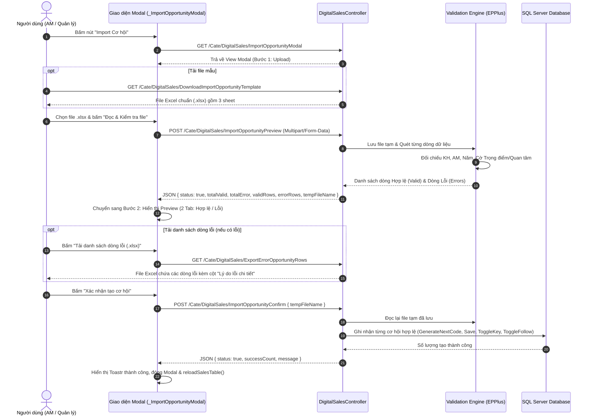

# 📘 TÀI LIỆU ĐẶC TẢ KỸ THUẬT VÀ NGHIỆP VỤ: CHỨC NĂNG IMPORT CƠ HỘI KINH DOANH SỐ (DIGITAL SALES OPPORTUNITY IMPORT)

> **Mã tài liệu:** `SPEC-CRM-DIGITALSALES-IMPORT-OPPORTUNITY`  
> **Phiên bản:** `2.0`  
> **Ngày ban hành:** `2026-09-30`  
> **Hệ thống:** CenIT TOC CRM - Phân hệ Kinh doanh Sản phẩm & Dịch vụ số  
> **Mục tiêu tài liệu:** Cung cấp đặc tả chi tiết, rõ ràng và đầy đủ nhất về mặt nghiệp vụ, luồng dữ liệu, thuật toán kiểm tra, cấu trúc tệp Excel, thiết kế API và giao diện để **tác nhân AI (AI Agent) hoặc lập trình viên có thể đọc hiểu và xây dựng/tái lập trình hoàn chỉnh tính năng mà không cần hỏi lại.**

---

## 1. TỔNG QUAN TÍNH NĂNG (FEATURE OVERVIEW)

### 1.1. Bối cảnh & Mục đích
- Trong quy trình quản lý kinh doanh dịch vụ số, các đơn vị kinh doanh thường phát sinh nhiều cơ hội mới từ các chiến dịch tiếp thị, hội thảo, danh sách khách hàng tiềm năng. Việc nhập tay từng cơ hội qua giao diện thêm mới tốn nhiều thời gian.
- **Tính năng "Import Cơ hội":** Cho phép người dùng tải lên tệp Excel (`.xlsx`), hệ thống tự động đọc, kiểm tra tính hợp lệ dữ liệu (Khách hàng, AM chủ trì, năm áp dụng, cơ chế phân quyền đơn vị), hiển thị bảng xem trước (preview) phân tách rõ ràng dòng hợp lệ và dòng lỗi, sau đó thực hiện ghi nhận hàng loạt vào cơ sở dữ liệu.

### 1.2. Quyền hạn & Phạm vi truy cập (Security & Scope)
- **Quyền thao tác:** Người dùng có quyền Tạo mới hồ sơ cơ hội kinh doanh (`EnumActionType.Create` trên màn hình `DigitalSales`).
- **Phạm vi phân quyền nhân sự (Data Scoping):**
  - Người dùng **chỉ được phép gán AM chủ trì là nhân sự thuộc đơn vị/phòng ban mình có thẩm quyền quản lý** (được cung cấp bởi hàm `GetAccessibleEmployees()`).
  - Hệ thống ngăn chặn tuyệt đối việc import cơ hội mà AM chủ trì thuộc đơn vị khác nằm ngoài phạm vi quản lý của người thực hiện.

---

## 2. QUY TRÌNH NGHIỆP VỤ & SƠ ĐỒ TUẦN TỰ (WORKFLOW & SEQUENCE)

Quy trình Import được thiết kế theo mô hình **2 bước an toàn (Safe 2-Step Lifecycle)**:



---

## 3. ĐẶC TẢ CẤU TRÚC FILE EXCEL MẪU (EXCEL TEMPLATE SPECIFICATION)

File Excel mẫu được tạo động bằng thư viện **EPPlus** với định dạng chuẩn `.xlsx`, bao gồm **3 Sheet**:

### 3.1. Sheet 1: `Danh_Sach_Co_Hoi` (Sheet nhập liệu chính)
Cấu trúc chuẩn gồm **8 cột** (Đã tinh giản theo đúng chỉ đạo nghiệp vụ: **bỏ** Xác suất %, Sản phẩm/Dịch vụ số, Doanh thu dự kiến vì cơ hội mới tiếp cận chưa xác định được doanh thu và sản phẩm cụ thể):

| Cột | Tên tiêu đề cột | Kiểu dữ liệu | Bắt buộc | Ràng buộc & Quy tắc | Ví dụ hợp lệ |
| :---: | :--- | :--- | :---: | :--- | :--- |
| **A** | `STT` | Số nguyên | Không | Số thứ tự tăng dần | `1`, `2`, `3` |
| **B** | `Tên cơ hội (*)` | Văn bản | **Có** | Độ dài tối đa 500 ký tự. Không được để trống. | `Trang bị tường lửa bảo đảm an ninh mạng các cơ quan` |
| **C** | `Mã khách hàng (*)` | Văn bản | **Có** | **Nhập Mã khách hàng (ShortName)**. Hệ thống cũng hỗ trợ nhập Mã số thuế hoặc ID hệ thống tra cứu từ Sheet 2. | `KHA-CAT`, `VP_XUANHAI`, `4200123456` |
| **D** | `AM chủ trì (*)` | Văn bản | **Có** | **Nhập Tên tài khoản (UserName)**, Mã nhân sự (UserId) hoặc Họ tên AM. Bắt buộc thuộc danh sách ở Sheet 3. | `tantd.kha`, `thaoct.kha` |
| **E** | `Năm áp dụng` | Số nguyên | Không | Năm từ `2000` đến `2100`. Nếu để trống -> Mặc định lấy năm hiện tại (`DateTime.Today.Year`). | `2026` |
| **F** | `Trọng điểm (Có/Không)` | Văn bản | Không | Chấp nhận các giá trị: `Có`, `Co`, `Yes`, `1`, `True`, `X` (không phân biệt hoa thường). Khác -> `Không`. | `Có` |
| **G** | `Đang quan tâm (Có/Không)` | Văn bản | Không | Chấp nhận các giá trị: `Có`, `Co`, `Yes`, `1`, `True`, `X` (không phân biệt hoa thường). Khác -> `Không`. | `Có` |
| **H** | `Ghi chú` | Văn bản | Không | Ghi chú thêm về cơ hội (lưu vào trường `Note` của Cơ hội). | `Cơ hội trọng điểm năm 2026, đang tiếp cận giai đoạn đầu` |

*Ghi chú định dạng:* Dòng tiêu đề có nền xanh navy (`#1F4E79`), chữ trắng, in đậm, căn giữa. Dòng mẫu có màu nền dịu (`#F2F7FA`). Đóng băng hàng tiêu đề (Freeze Panes dòng 1).

### 3.2. Sheet 2: `Danh_Sach_Khach_Hang` (Sheet tra cứu)
Nạp toàn bộ danh mục khách hàng (`RM_Customer`) từ database để người dùng dễ dàng copy mã đưa vào Sheet 1:
- Cột A: **Mã khách hàng (ShortName)** - Ưu tiên hiển thị ShortName, nếu trống fallback sang TaxCode hoặc CustomerID. (Format text `@` để không mất số 0).
- Cột B: **Tên khách hàng** - Đã chuẩn hóa loại bỏ chuỗi người đại diện (sử dụng hàm `CleanCustomerName`).
- Cột C: **Mã số thuế** (Format text `@`).
- Cột D: **Mã ID hệ thống** (`CustomerID`).
- Cột E: **Địa chỉ** (`AddressCus`).

### 3.3. Sheet 3: `Danh_Sach_Nhan_Su` (Sheet tra cứu AM)
Chỉ nạp danh sách nhân sự **thuộc phạm vi đơn vị quản lý của người dùng hiện tại** (`GetAccessibleEmployees()`):
- Cột A: **Mã nhân sự** (`UserId`).
- Cột B: **Tên tài khoản** (`UserName`) - Giá trị khuyên dùng để nhập vào cột AM ở Sheet 1.
- Cột C: **Họ và tên nhân sự** (`FullName`).
- Cột D: **Phòng ban / Đơn vị** (`TenBoPhan`).

---

## 4. BỘ QUY TẮC KIỂM TRA HỢP LỆ DỮ LIỆU (VALIDATION ENGINE SPECIFICATION)

Validation Engine chạy qua từng hàng dữ liệu của tệp Excel từ dòng 2 đến hết `Dimension.End.Row`:

### 4.1. Nhận diện Dòng trống (Empty Row Detection)
```csharp
private static bool IsOpportunityImportRowEmpty(ExcelWorksheet ws, int rowNumber)
{
    var title = ws.Cells[rowNumber, 2].Value?.ToString();
    var customer = ws.Cells[rowNumber, 3].Value?.ToString();
    var am = ws.Cells[rowNumber, 4].Value?.ToString();
    return string.IsNullOrWhiteSpace(title) && string.IsNullOrWhiteSpace(customer) && string.IsNullOrWhiteSpace(am);
}
```
*Nếu dòng trống hoàn toàn: Bỏ qua không tính là lỗi, không đưa vào danh sách.*

### 4.2. Ràng buộc Tên cơ hội (Field: `Title`)
- **Điều kiện:** `!string.IsNullOrWhiteSpace(row.Title)`.
- **Thông báo lỗi nếu vi phạm:** `"Tên cơ hội không được để trống."`

### 4.3. Ràng buộc Khách hàng (Field: `CustomerID`)
Hệ thống sử dụng cơ chế **Tra cứu đa tầng (Multi-tier Lookup)** trên Dictionary bộ nhớ đệm:
1. `cusByShortName`: Tìm kiếm chính xác theo `ShortName` (viết thường).
2. `cusByTaxCode`: Tìm kiếm chính xác theo `TaxCode` (viết thường).
3. `cusById`: Nếu chuỗi nhập vào là số nguyên, tìm theo `CustomerID`.
4. `cusByName`: Tìm kiếm chính xác theo tên khách hàng đầy đủ.
5. `cusByName.Values.FirstOrDefault(...)`: Tìm kiếm tương đối (chứa từ khóa trong tên KH).

- **Nếu không tìm thấy:** Thêm lỗi: `"Mã khách hàng '{CustomerInput}' không tìm thấy trong hệ thống."`
- **Xử lý Tên Khách hàng hiển thị (Anti-Representative String):**
  Tên khách hàng lấy ra phải chạy qua hàm chuẩn hóa `RM_DigitalSalesBiz.CleanCustomerName(cus.CustomerName)` để loại bỏ chuỗi người đại diện phía trước:
  ```csharp
  // Loại bỏ các tiền tố nằm trong ngoặc đơn hoặc ngoặc vuông ở đầu chuỗi
  Regex.Replace(customerName.Trim(), @"^\s*[\(\[][^\)\]]+[\)\]]\s*", "").Trim();
  // Ví dụ: "[Người đại diện: Nguyễn Văn A] Ban Chỉ Huy Quân Sự Tỉnh" -> "Ban Chỉ Huy Quân Sự Tỉnh"
  ```

### 4.4. Ràng buộc AM chủ trì (Field: `AssignedEmployeeID`)
AM chủ trì bắt buộc phải thuộc danh sách `GetAccessibleEmployees()`:
1. Tìm theo số nguyên `UserId` trong `empById`.
2. Tìm theo chuỗi `UserName` trong `empByUserName`.
3. Tìm theo chuỗi `FullName` trong `empByFullName`.

- **Nếu không tìm thấy hoặc AM thuộc đơn vị khác:** Thêm lỗi: `"AM chủ trì '{AMInput}' không tồn tại hoặc không thuộc đơn vị quản lý của bạn."`

### 4.5. Ràng buộc Năm áp dụng (Field: `ApplyYear`)
- Nếu có nhập: Phải là số nguyên từ `2000` đến `2100`. Nếu sai phạm vi: `"Năm áp dụng không hợp lệ (phải từ 2000 đến 2100)."`
- Nếu để trống: Tự động gán bằng `DateTime.Today.Year`.

### 4.6. Phân tách Dòng Hợp lệ và Dòng Lỗi
- Mỗi dòng dữ liệu được biểu diễn bởi Model `RM_DigitalSalesImportRowModel`:
  - Nếu `row.Errors.Count == 0`: Đưa vào `previewValidRows` (tối đa 50 dòng xem trước) và tăng `totalValid`.
  - Nếu `row.Errors.Count > 0`: Đưa vào `previewErrorRows` (tối đa 50 dòng xem trước), lưu toàn bộ vào `allErrorRows` trong `Session["ImportOpportunityErrorData"]`, tăng `totalError`.

---

## 5. THIẾT KẾ CƠ SỞ DỮ LIỆU & LƯU TRỮ (DATABASE & COMMIT LOGIC)

Khi người dùng nhấn **"Xác nhận tạo cơ hội"**, với mỗi dòng hợp lệ, hệ thống thực hiện:

### 5.1. Khởi tạo đối tượng `RM_DigitalSalesModel`
```csharp
var salesModel = new RM_DigitalSalesModel
{
    Code = _salesCache.GenerateNextCode(),          // Tự động sinh mã duy nhất: SPDV-YYYY-XXXX
    Title = row.Title.Trim(),                       // Tên cơ hội
    BusinessType = 1,                               // 1: Cơ hội kinh doanh (2: Dự án)
    StatusID = 1,                                   // 1: Trạng thái khởi tạo mặc định (Chưa tiếp cận)
    CustomerID = row.CustomerID,                   // ID Khách hàng đã đối chiếu
    AssignedEmployeeID = row.AssignedEmployeeID,   // ID Nhân sự AM chủ trì
    DepartmentID = deptId > 0 ? deptId : null,      // Phòng ban của AM
    ApplyYear = row.ApplyYear.Value,                // Năm áp dụng
    ClosingProbability = 50,                        // Xác suất đóng mặc định 50%
    StartDate = DateTime.Today,                     // Ngày bắt đầu mặc định: Hôm nay
    ExpectedDate = DateTime.Today.AddMonths(1),     // Ngày dự kiến đóng: 1 tháng sau
    Note = !string.IsNullOrWhiteSpace(row.Note)     // Ghi chú cơ hội
        ? FormatHtmlContent(row.Note) 
        : null
};

int digitalSalesId = _salesCache.Save(salesModel, currentUserName);
```

### 5.2. Kích hoạt cờ phụ trợ
- Nếu `row.IsKey == true`: Gọi `_salesCache.ToggleKeyProject(digitalSalesId, true, currentUserName)`.
- Nếu `row.IsFocus == true`: Gọi `_salesCache.ToggleFollow(digitalSalesId, true, currentUserName)`.

### 5.3. Bảng cơ sở dữ liệu liên quan
- `dbo.RM_DigitalSales`: Bảng chứa hồ sơ cơ hội kinh doanh.
- `dbo.RM_Customer`: Bảng danh mục khách hàng.
- `dbo.Sys_User` & `dbo.MN_BoPhan`: Bảng nhân sự và cơ cấu phòng ban.
- `dbo.RM_DigitalSalesKeyProject`: Bảng đánh dấu cơ hội trọng điểm.
- `dbo.RM_DigitalSalesFollow`: Bảng đánh dấu cơ hội quan tâm/theo dõi.

---

## 6. CHI TIẾT CÁC API ENDPOINTS (CONTROLLER SPECIFICATION)

Tất cả các Action đặt trong `Modules.Cate.Areas.Cate.Controllers.DigitalSalesController`:

### 6.1. `GET: /Cate/DigitalSales/ImportOpportunityModal`
- **Mục đích:** Mở popup modal Import Cơ hội.
- **Header:** `[AjaxOnly]`, `[ActionType(Type = EnumActionType.Create)]`.
- **Trả về:** PartialView `_ImportOpportunityModal.cshtml`.

### 6.2. `GET: /Cate/DigitalSales/DownloadImportOpportunityTemplate`
- **Mục đích:** Xuất tệp Excel mẫu `.xlsx` gồm 3 sheet chuẩn dữ liệu của người dùng hiện tại.
- **Header:** `[ActionType(Type = EnumActionType.View)]`.
- **MimeType:** `application/vnd.openxmlformats-officedocument.spreadsheetml.sheet`.
- **Tên file tải về:** `Mau_Import_Co_Hoi_{yyyyMMdd_HHmmss}.xlsx`.

### 6.3. `POST: /Cate/DigitalSales/ImportOpportunityPreview`
- **Mục đích:** Đọc file người dùng upload, lưu file tạm vào thư mục `~/Contents/Uploads/Temp`, validate dữ liệu.
- **Header:** `[ActionType(Type = EnumActionType.Create)]`.
- **Tham số:** `HttpPostedFileBase importFile`.
- **Response Format (JSON):**
```json
{
  "status": true,
  "tempFileName": "ImportOpportunity_3a7b2c9d1e4f...xlsx",
  "totalValid": 15,
  "totalError": 2,
  "validRows": [
    {
      "RowNumber": 2,
      "Title": "Cung cấp giải pháp phần mềm quản trị bệnh viện",
      "CustomerID": 128,
      "CustomerName": "Bệnh viện Đa khoa Tỉnh",
      "CustomerShortName": "BVDK_TINH",
      "AssignedEmployeeID": 641,
      "AMUserName": "tantd.kha",
      "AMFullName": "Trần Duy Tân",
      "ApplyYear": 2026,
      "IsKey": true,
      "IsFocus": true,
      "Note": "Khách hàng có nhu cầu gấp trong Q4"
    }
  ],
  "errorRows": [
    {
      "RowNumber": 5,
      "Title": "Triển khai hệ thống mạng LAN",
      "CustomerInput": "KH_KHONG_TON_TAI",
      "AMInput": "nguyenvana",
      "ApplyYear": 2026,
      "Errors": [
        "Mã khách hàng 'KH_KHONG_TON_TAI' không tìm thấy trong hệ thống.",
        "AM chủ trì 'nguyenvana' không tồn tại hoặc không thuộc đơn vị quản lý của bạn."
      ]
    }
  ],
  "hasMoreErrors": false,
  "hasMoreValid": false
}
```

### 6.4. `POST: /Cate/DigitalSales/ImportOpportunityConfirm`
- **Mục đích:** Commit các dòng hợp lệ vào cơ sở dữ liệu.
- **Tham số:** `string tempFileName` (kết hợp với `Session["ImportOpportunityFilePath"]` và fallback tìm file mới nhất trong `Temp` để tránh đứt gãy phiên làm việc).
- **Cơ chế dọn dẹp:** Sau khi import xong (hoặc gặp lỗi), tự động xóa file tạm trong thư mục `Temp` và giải phóng Session.
- **Response Format (JSON):**
```json
{
  "status": true,
  "successCount": 15,
  "failCount": 0,
  "message": "Đã tạo thành công 15 cơ hội kinh doanh!"
}
```

### 6.5. `GET: /Cate/DigitalSales/ExportErrorOpportunityRows`
- **Mục đích:** Xuất toàn bộ các dòng bị lỗi trong tệp vừa tải lên thành tệp Excel riêng để người dùng sửa lại.
- **Cơ chế Tracking:** Nhận `cookieName`, ghi Cookie khi xuất xong để client ẩn spinner loading.
- **Cấu trúc tệp xuất:** Gồm các cột thông tin gốc + Cột **"Lý do lỗi chi tiết"** tô nền đỏ viền cảnh báo (`#C00000`, nền `#FFF2CC`).

---

## 7. ĐẶC TẢ GIAO DIỆN & TƯƠNG TÁC (UI/UX SPECIFICATION)

### 7.1. Cấu trúc Modal HTML & Bootstrap
- **ID Modal:** `#modalImportOpportunity`.
- **Kích thước:** `modal-xl` (chiều rộng tối đa 1140px, chuẩn giao diện mở rộng).
- **Thuộc tính:** `data-backdrop="static"` (chống bấm nhầm ra ngoài làm mất dữ liệu preview).
- **Cấu trúc 2 bước (Two-step UI Switcher):**
  - **Bước 1 (`#stepOppUpload` & `#footerOppUpload`):**
    - Hộp tải file mẫu có nút tải tệp `.xlsx`.
    - Ô chọn file kéo thả / duyệt file `.xlsx` (`#importOppFileInput`).
    - Thanh progress bar animation (`#uploadOppProgress`).
    - Nút hành động: `Đóng` và `Đọc & Kiểm tra file`.
  - **Bước 2 (`#stepOppPreview` & `#footerOppPreview`):**
    - Khối tóm tắt (`#importOppSummary`): 2 Card số liệu (Hợp lệ xanh lá, Lỗi đỏ cam).
    - Bộ Tab (`#importOppTabs`):
      - Tab 1: **Hợp lệ, sẵn sàng tạo** (Kèm badge đếm số lượng xanh).
      - Tab 2: **Dữ liệu lỗi (sẽ bỏ qua)** (Kèm badge đếm số lượng đỏ).
    - Nút hành động: `Tải danh sách dòng lỗi (.xlsx)` (nếu có lỗi), `Chọn lại file` (quay về Bước 1), `Xác nhận tạo cơ hội` (nút màu xanh lá nổi bật).

### 7.2. Micro-interactions & Quản lý vòng đời Modal (Clean Modal Lifecycle)
- Khi bấm **"Xác nhận tạo cơ hội"**:
  - Nút chuyển sang trạng thái disabled và hiển thị Spinner: `<i class="fa fa-spinner fa-spin"></i> Đang tạo cơ hội...`.
  - Khi thành công: Hiển thị Toastr thông báo màu xanh, gọi `reloadSalesTable()`, đóng Modal sau 1.2s, **loại bỏ sạch sẽ backdrop (`$(".modal-backdrop").remove()`) và class `modal-open` trên thẻ `body`** để tránh kẹt màn hình tối.

---

## 8. QUY CHUẨN TUÂN THỦ HỆ THỐNG (SYSTEM COMPLIANCE & RULES)

Bất kỳ AI Agent hoặc Developer nào khi triển khai tính năng này **BẮT BUỘC** tuân thủ các nguyên tắc từ `TESTING.md`:

1. **Triple Mirroring (Đồng bộ 3 vị trí):**
   - Mọi thay đổi mã nguồn trên View Razor (`_ImportOpportunityModal.cshtml`), Style (`_ImportOpportunityModal.css`), JavaScript (`DigitalSales.js`), và DLL (`Modules.Cate.dll`) PHẢI tồn tại đồng nhất về Hash SHA-256 trên cả 3 thư mục:
     - `Modules.Cate/...`
     - `publish_source/...`
     - `CenIT.Solution.TOC.WebApp/...`
2. **UTF-8 with BOM:**
   - Tệp Razor `.cshtml` phải có tiền tố `0xEF, 0xBB, 0xBF` để máy chủ IIS không bao giờ văng lỗi font tiếng Việt.
3. **No Inline Styles:**
   - 100% định dạng CSS của modal phải nằm trong tệp `_ImportOpportunityModal.css` riêng biệt, nhúng kèm timestamp cache-busting: `?v=@DateTime.Now.Ticks`.
4. **No Console Errors:**
   - 100% các thao tác chọn file, đọc file, chuyển tab, xuất file lỗi, submit tạo cơ hội không được văng bất kỳ lỗi runtime Javascript nào.

---

## 9. DANH MỤC KỊCH BẢN KIỂM THỬ (TEST CASES & QA MATRIX)

| Mã TC | Tên ca kiểm thử | Dữ liệu đầu vào | Kết quả mong đợi |
| :---: | :--- | :--- | :--- |
| **TC-01** | Tải file mẫu Excel | Bấm nút "Tải file mẫu Excel" | Tải thành công file `.xlsx` gồm 3 sheet: Danh_Sach_Co_Hoi, Danh_Sach_Khach_Hang, Danh_Sach_Nhan_Su. Dữ liệu tra cứu chuẩn. |
| **TC-02** | Upload file rỗng hoặc không đúng định dạng | Chọn file `.txt`, `.png` hoặc `.xlsx` 0 byte | Báo lỗi thông báo rõ ràng, không làm sập trang. |
| **TC-03** | Happy Path: File 10 dòng chuẩn 100% | 10 cơ hội có Mã KH, AM hợp lệ, năm 2026 | Card hiển thị 10 hợp lệ, 0 lỗi. Nút Xác nhận hoạt động, tạo đúng 10 bản ghi cơ hội trong DB với mã `SPDV-2026-xxxx`. |
| **TC-04** | Mã khách hàng không tồn tại | Cột Mã KH nhập chuỗi ngẫu nhiên | Dòng đó rơi vào Tab Dữ liệu lỗi với lý do: `"Mã khách hàng '...' không tìm thấy trong hệ thống."` |
| **TC-05** | AM chủ trì ngoài phạm vi quản lý | Cột AM nhập UserName của nhân sự thuộc phòng ban khác | Dòng đó rơi vào Tab Dữ liệu lỗi: `"AM chủ trì '...' không tồn tại hoặc không thuộc đơn vị quản lý của bạn."` |
| **TC-06** | Bỏ trống tiêu đề cơ hội | Cột Tên cơ hội để trống | Báo lỗi: `"Tên cơ hội không được để trống."` |
| **TC-07** | Nhập năm áp dụng không hợp lệ | Cột Năm nhập `1990` hoặc `abc` | Báo lỗi: `"Năm áp dụng không hợp lệ (phải từ 2000 đến 2100)."` |
| **TC-08** | Chuẩn hóa tên khách hàng có người đại diện | KH có tên `(ĐD: Trần Văn B) Sở Thông Tin và Truyền Thông` | Tên KH trên Preview hiển thị sạch: `Sở Thông Tin và Truyền Thông` (đã bỏ chuỗi người đại diện). |
| **TC-09** | Tải danh sách dòng lỗi | Bấm "Tải danh sách dòng lỗi" khi có lỗi | Tải file Excel chứa các dòng lỗi và cột Lý do lỗi chi tiết. Spinner dừng mượt mà. |
| **TC-10** | Xác nhận chỉ tạo các dòng hợp lệ | File gồm 3 dòng hợp lệ, 2 dòng lỗi | Chỉ tạo đúng 3 cơ hội vào CSDL. 2 dòng lỗi bị loại bỏ an toàn. Bảng dữ liệu ngoài trang chính tự động reload. |

---

## 10. HƯỚNG DẪN DÀNH CHO AI AGENT KHI THỰC THI (AI IMPLEMENTATION CHECKLIST)

Khi được yêu cầu xây dựng mới hoặc sửa đổi tính năng Import Cơ hội, AI Agent cần thực hiện tuần tự:

1. **Kiểm tra Model:** Đảm bảo `RM_DigitalSalesImportRowModel` có đủ các trường: `RowNumber`, `Title`, `CustomerInput`, `AMInput`, `ApplyYear`, `IsKey`, `IsFocus`, `Note`, `CustomerID`, `CustomerName`, `AssignedEmployeeID`, `Errors`.
2. **Kiểm tra Cache & Biz Layer:** Đảm bảo `RM_DigitalSalesBiz.CleanCustomerName()` đã có và hoạt động chuẩn.
3. **Kiểm tra Controller:** Đối chiếu 5 Actions trong `DigitalSalesController.cs` (Region 10: Import Opportunity) đúng theo tài liệu này.
4. **Kiểm tra View & JS:** Đối chiếu `_ImportOpportunityModal.cshtml` và các hàm `openImportOpportunityModal`, `initImportOpportunity`, `renderOpportunityImportPreview` trong `DigitalSales.js`.
5. **Biên dịch & Đồng bộ:** Chạy MSBuild với cấu hình Release (`0 Errors`), chạy script Triple Mirroring đồng bộ qua `Modules.Cate`, `publish_source`, `WebApp`.
6. **Kiểm tra BOM:** Đảm bảo UTF-8 BOM trên toàn bộ tệp `.cshtml`.
