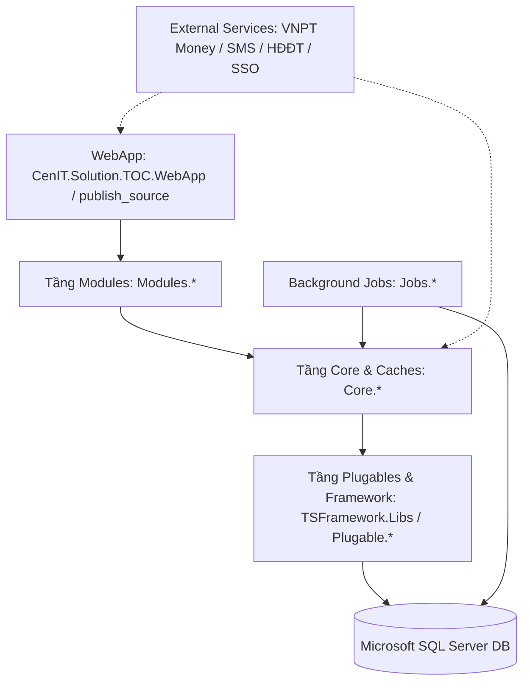

# 🏛️ CenIT TOC CRM - Hệ Thống Quản Lý Quan Hệ Khách Hàng & Kinh Doanh Dịch Vụ Số

> **Đơn vị vận hành & phát triển:** VNPT Khánh Hòa – Trung Tâm Kinh Doanh Giải Pháp (TTKDGP)  
> **Nền tảng công nghệ:** ASP.NET MVC 5 (.NET Framework 4.8), C#, Microsoft SQL Server, Ace Admin v4 / Bootstrap, Quartz.NET  
> **Kiến trúc:** Enterprise Multi-tier Modular Architecture (Cores – Modules – Plugables – Background Jobs)

---

## 📑 Mục Lục

- [1. Giới Thiệu Tổng Quan](#1-giới-thiệu-tổng-quan)
- [2. Kiến Trúc Hệ Thống & Tổ Chức Solution](#2-kiến-trúc-hệ-thống--tổ-chức-solution)
- [3. Chi Tiết Các Phân Hệ Nghiệp Vụ Cốt Lõi](#3-chi-tiết-các-phân-hệ-nghiệp-vụ-cốt-lõi)
- [4. Công Nghệ & Thư Viện Sử Dụng](#4-công-nghệ--thư-viện-sử-dụng)
- [5. Quy Chuẩn Kỹ Thuật & Best Practices](#5-quy-chuẩn-kỹ-thuật--best-practices)
- [6. Cài Đặt Môi Trường & Khởi Chạy Dự Án](#6-cài-đặt-môi-trường--khởi-chạy-dự-án)
- [7. Quy Trình Đóng Gói & Triển Khai (CI/CD & Deployment)](#7-quy-trình-đóng-gói--triển-khai-cicd--deployment)
- [8. Đảm Bảo Chất Lượng & Bộ Kiểm Thử 5 Tầng](#8-đảm-bảo-chất-lượng--bộ-kiểm-thử-5-tầng)
- [9. Bản Đồ Thư Mục & Tài Liệu Liên Quan](#9-bản-đồ-thư-mục--tài-liệu-liên-quan)

---

## 1. Giới Thiệu Tổng Quan

**CenIT TOC CRM** là hệ thống phần mềm quản lý quan hệ khách hàng, cơ hội kinh doanh giải pháp dịch vụ số, quản trị dự án công nghệ thông tin và tiến trình triển khai hợp đồng được thiết kế may đo cho Trung Tâm Kinh Doanh Giải Pháp (TTKDGP) - VNPT Khánh Hòa.

### Mục tiêu bài toán
1. **Quản lý Vòng đời Cơ hội Kinh doanh Dịch vụ Số (Digital Sales Lifecycle):** Từ giai đoạn tiếp cận khách hàng, tư vấn giải pháp, khảo sát, lập báo giá/dự toán, thương thảo đến ký kết hợp đồng và nghiệm thu.
2. **Theo dõi Tiến trình & Checklist Công việc Chuẩn hóa:** Tự động áp dụng quy trình mẫu theo từng nhóm dịch vụ/sản phẩm; giám sát từng đầu việc chi tiết, người chịu trách nhiệm (AM/Kỹ thuật) và thời hạn hoàn thành.
3. **Cảnh báo Thông minh & Giám sát Tương tác:** Cảnh báo các cơ hội kinh doanh chậm cập nhật thông tin tương tác (> 72 giờ), giám sát dự án trọng điểm và dự án người dùng đang quan tâm.
4. **Báo cáo & Dashboard Điều hành Tập trung:** Trực quan hóa doanh thu dự kiến, doanh thu thực tế, tỷ lệ chuyển đổi, phân bổ theo nhóm dịch vụ và tình trạng hợp đồng.

---

## 2. Kiến Trúc Hệ Thống & Tổ Chức Solution

Hệ thống được tổ chức theo mô hình **Đa tầng Module hóa (Modular N-Tier Architecture)** kết hợp kiến trúc thực thi Stored Procedure động, đảm bảo khả năng mở rộng, tách biệt rõ ràng giữa tầng nghiệp vụ và giao diện.



### Danh mục Projects trong Solution `CenIT.Solution.TOC.sln`:

| Thư mục / Project | Loại hình | Vai trò & Trách nhiệm |
| :--- | :--- | :--- |
| **`CenIT.Solution.TOC.WebApp`** | Presentation | Ứng dụng Web chính ASP.NET MVC 5; chứa Master Layouts, Routing tổng, Assets, và tích hợp các Modules. |
| **`publish_source`** | Deployment | Thư mục chứa gói build đầy đủ sẵn sàng triển khai lên IIS Web Server hoặc FTP Demo. |
| **`Modules.Cate`** | MVC Area Module | Phân hệ Danh mục & Nghiệp vụ: Cơ hội kinh doanh (`RM_BusinessOpportunity`), SPDV Số (`DigitalSales`), Dự án (`Project`), Khách hàng, Hợp đồng, Tiến trình. |
| **`Modules.Dashboard`** | MVC Area Module | Phân hệ Báo cáo & Dashboard: Biểu đồ doanh thu SPDV Số, biểu đồ theo trạng thái, bảng tổng hợp dự án trọng điểm & chậm cập nhật. |
| **`Modules.Sys`** | MVC Area Module | Phân hệ Hệ thống: Quản lý người dùng, nhóm quyền, menu điều hướng, từ điển tin nhắn `Sys_Messages`, cấu hình tham số. |
| **`Modules.API`** | Web API Module | Cung cấp RESTful Web API cho ứng dụng di động (Flutter) và các dịch vụ tích hợp bên ngoài. |
| **`Core.Cate`** | Business & Cache | Logic nghiệp vụ, Data Models, Data Access, và bộ đệm (`RM_DigitalSalesCache`) cho phân hệ Cate. |
| **`Core.Dashboard`** | Business & Cache | Xử lý dữ liệu tổng hợp, thống kê, KPIs cho phân hệ Dashboard. |
| **`Core.Sys`** | Business & Cache | Logic xác thực, ủy quyền, quản trị người dùng, logging và cache tin nhắn hệ thống. |
| **`Core.API`** | Business Logic | Tầng xử lý nghiệp vụ cho REST API và xác thực token. |
| **`Core.Log`** | Logging Infrastructure | Ghi nhật ký truy cập, audit trail, lịch sử thao tác dữ liệu. |
| **`TSFramework.Libs`** | Core Framework | Bộ thư viện nền tảng của CenIT: `StoreProcedureProvider`, `BaseController`, caching, serialization, session helpers. |
| **`Plugable.SQLProcedureProcessor`** | Data Access Plugin | Trình thực thi Stored Procedure động và ánh xạ dữ liệu sang Object Models. |
| **`Plugable.SQLProcedureAuthority`** | Security Plugin | Kiểm soát phân quyền thực thi ở cấp Stored Procedure và chức năng nghiệp vụ. |
| **`Jobs.*`** | Quartz Background Services | Tự động hóa: nhắc việc cơ hội kinh doanh, gửi email, đồng bộ dữ liệu, dọn dẹp dữ liệu log rác. |
| **`Libs.VNPTMoney.Payment`** | External Integration | Tích hợp cổng thanh toán trực tuyến VNPT Money. |
| **`CenIT.Lib.SMSBrandName`** | External Integration | Tích hợp gửi tin nhắn thương hiệu SMS Brandname. |
| **`CenIT.Libs.HDDT`** | External Integration | Tích hợp phát hành và tra cứu Hóa đơn điện tử VNPT Invoice. |
| **`CenIT.SSOServices`** | Security Integration | Dịch vụ đăng nhập một lần (Single Sign-On). |

---

## 3. Chi Tiết Các Phân Hệ Nghiệp Vụ Cốt Lõi

### 3.1. Quản lý Sản phẩm Dịch vụ Số (`Cate/DigitalSales`)
- **Bộ lọc tìm kiếm đa tiêu chí:** Lọc theo từ khóa, Loại hình (Cơ hội / Dự án), nhóm Trạng thái đa chọn, Năm áp dụng (`ApplyYear`), Phòng ban TTKDGP, AM chủ trì, Dự án trọng điểm (`IsKeyProject`), Dự án đang quan tâm (`IsFollowed`), khoảng thời gian.
- **Quản lý tương tác thời gian thực:** Đánh dấu sao theo dõi/bỏ theo dõi (`ToggleFollow`), cập nhật nhanh trạng thái qua modal chuyển trạng thái chuyên dụng (`_ChangeStatusModal`).
- **Phân tách doanh thu:** Theo dõi song song Doanh thu dự kiến và Doanh thu thực tế (đã ký hợp đồng).

### 3.2. Tiến trình, Checklist & Dòng thời gian (`Timeline & Tasks`)
- **Mẫu tiến trình chuẩn hóa:** Cấu hình các bước nghiệp vụ (Khảo sát, Trình diễn giải pháp, Lập hồ sơ mời thầu, Đấu thầu, Nghiệm thu...).
- **Checklist công việc:** Từng bước có danh sách kiểm tra đầu việc chi tiết, trạng thái hoàn thành, người phụ trách và tài liệu kiểm chứng.
- **Lịch sử hoạt động (Activities Log):** Ghi nhận toàn bộ trao đổi, nhật ký làm việc của AM với khách hàng theo từng mốc thời gian.

### 3.3. Dashboard & Trung Tâm Điều Hành (`Dashboard/Chart`)
- **Cards Thống kê KPIs:** Tổng số cơ hội/dự án, cơ hội thành công, cơ hội đang triển khai, cơ hội rủi ro.
- **Biểu đồ trực quan:**
  - Biểu đồ phân bổ doanh thu theo Nhóm dịch vụ số (đơn vị Triệu đồng).
  - Biểu đồ cơ hội kinh doanh theo trạng thái tiến trình.
- **Bảng giám sát nhanh:**
  1. Danh sách các dự án **Trọng điểm**.
  2. Danh sách cơ hội kinh doanh **Đang quan tâm**.
  3. Cảnh báo danh sách SPDV số **Chưa cập nhật tương tác quá 72 giờ**.

### 3.4. Quản trị Phân quyền 2 Tầng & Quốc tế hóa (`Sys`)
- **Phân quyền 2 tầng:** Kiểm soát chặt chẽ cả ở tầng giao diện (ẩn/hiện nút theo `Authority`) và tầng Database (chặn gọi Stored Procedure nếu user không có quyền tương ứng).
- **Từ điển tin nhắn tập trung (`Sys_Messages`):** Toàn bộ nhãn, thông báo thành công, cảnh báo lỗi đều được quản lý tập trung trong CSDL SQL Server và cache vào memory, không hardcode tiếng Việt trong mã C#.

---

## 4. Công Nghệ & Thư Viện Sử Dụng

### Backend
- **Framework:** .NET Framework 4.8 / ASP.NET MVC 5 / ASP.NET Web API 2.
- **Ngôn ngữ:** C# 7.3+.
- **Data Access:** Microsoft SQL Server qua ADO.NET tối ưu hóa cao với Stored Procedures và `StoreProcedureProvider`.
- **Background Jobs:** Quartz.NET scheduler độc lập.
- **Bảo mật:** Forms Authentication, Anti-Forgery Tokens (`@Html.AntiForgeryToken()`), SQL Injection Protection (100% Parameterized SQL).

### Frontend
- **CSS Architecture:** Ace Admin v4 Responsive UI Framework xây dựng trên nền **Bootstrap 4**.
- **Icons & Typography:** FontAwesome 5/6, Open Sans, Roboto.
- **JavaScript Core:** jQuery 3.x, Native ES5/ES6.
- **Data Table:** jQuery DataTables với server-side AJAX processing, responsive columns, paging tùy chỉnh.
- **UI Components:** Select2, Chosen, Bootstrap Datepicker, Summernote / CKEditor, SweetAlert2, Toastr notifications.

---

## 5. Quy Chuẩn Kỹ Thuật & Best Practices

Để duy trì chất lượng mã nguồn cao nhất, mọi đóng góp mã nguồn BẮT BUỘC tuân thủ các quy tắc sau:

### 5.1. Quy tắc Đồng bộ 3 Nơi (Triple Mirroring Rule)
Khi thay đổi bất kỳ tệp View (`.cshtml`), Script (`.js`), hoặc Style (`.css`), nội dung tệp phải được cập nhật **đồng nhất 100% (cùng mã hash MD5)** trên cả 3 cây thư mục:
1. `Modules.[Area]\Areas\[Area]\Views\...` *(Mã nguồn phát triển)*
2. `publish_source\Areas\[Area]\Views\...` *(Bản phát hành chuẩn bị deploy)*
3. `CenIT.Solution.TOC.WebApp\Areas\[Area]\Views\...` *(Ứng dụng Web host cục bộ)*

### 5.2. Quy chuẩn Định dạng Encoding (UTF-8 with BOM)
- 100% tệp `.cshtml`, `.js`, `.cs`, `.sql`, `.config`, `.md` **BẮT BUỘC** lưu dưới định dạng **UTF-8 with BOM** (`0xEF, 0xBB, 0xBF`).
- Nghiêm cấm tuyệt đối lưu tệp dưới định dạng ANSI hoặc UTF-8 No BOM để tránh lỗi hiển thị tiếng Việt trên máy chủ IIS Razor Engine.

### 5.3. Quy chuẩn Form Controls (`@Html.*` Helpers)
- **Cấm dùng thẻ HTML thuần:** Tuyệt đối không dùng `<label>`, `<input>`, `<select>`, `<textarea>` trực tiếp khi đã có sẵn `@Html.*` helper tương ứng.
- **Sử dụng đúng helper chuẩn CenIT TOC:**
  - Nhãn hiển thị: `@Html.TitleFor(m => m.FieldName, new { @class = "font-bold" })`
  - Nhập văn bản: `@Html.TextBoxFor(m => m.FieldName, new { @class = "form-control" })`
  - Dropdown: `@Html.DropDownListFor(...)`
  - Hidden ID: `@Html.HiddenFor(...)`
  - CSRF Token: `@Html.AntiForgeryToken()`

### 5.4. Quy tắc Cache Layer An toàn (Anti-Cache Poisoning)
- Toàn bộ hàm sinh khóa bộ đệm tìm kiếm (ví dụ `BuildSearchCacheKey`) **bắt buộc phải đưa tất cả tham số tìm kiếm vào key** (bao gồm `ApplyYear`, `DepartmentID`, `EmployeeID`, `IsKeyProject`, `IsFollowed`, v.v.).
- Tuyệt đối không bỏ sót tham số lọc để tránh hiện tượng ô nhiễm cache rỗng giữa các điều kiện tìm kiếm khác nhau.

### 5.5. Quy tắc Chống xung đột DOM ID (Anti-DOM ID Collision)
- ID của các thẻ `<input>`, `<select>`, `<textarea>` trong các Partial View Modal (`_Add`, `_Edit`, `_ChangeStatusModal`) **không được trùng với ID trên trang danh sách cha**.
- Bắt buộc đặt hậu tố định danh phân biệt: ví dụ `CustomerID_Add`, `CustomerID_Edit`, `ApplyYear_Modal`.

---

## 6. Cài Đặt Môi Trường & Khởi Chạy Dự Án

### 6.1. Yêu cầu Tiên quyết (Prerequisites)
- **Hệ điều hành:** Windows 10/11 hoặc Windows Server 2016/2019/2022.
- **IDE:** Visual Studio 2019 / 2022 (cài đặt Workload: *ASP.NET and web development*, bao gồm *.NET Framework 4.8 targeting pack*).
- **Hệ quản trị CSDL:** Microsoft SQL Server 2016 trở lên.
- **Web Server:** IIS 8.5+ với ASP.NET 4.8 features được kích hoạt (hoặc IIS Express khi debug cục bộ).

### 6.2. Cấu hình Chuỗi Kết Nối CSDL
Kiểm tra và cấu hình các chuỗi kết nối trong tệp `CenIT.Solution.TOC.WebApp\Web.config` hoặc `Configs\AppSettings.config`:

```xml
<connectionStrings>
  <add name="TOC.Sys.Conn" connectionString="Data Source=10.57.30.10;Initial Catalog=quanlydoanhthucenit;Persist Security Info=True;User Id=quanlydoanhthucenit;Password=******;Connect Timeout=200; Pooling=true; Max Pool Size=200;" />
  <add name="TOC.Conn.Major" connectionString="Data Source=10.57.30.10;Initial Catalog=quanlydoanhthucenit;Persist Security Info=True;User Id=quanlydoanhthucenit;Password=******;Connect Timeout=200; Pooling=true; Max Pool Size=200;" />
  <add name="TOC.Conn.Sys" connectionString="Data Source=10.57.30.10;Initial Catalog=quanlydoanhthucenit;Persist Security Info=True;User Id=quanlydoanhthucenit;Password=******;Connect Timeout=200; Pooling=true; Max Pool Size=200;" />
  <add name="TOC.Conn.Logs" connectionString="Data Source=10.57.30.10;Initial Catalog=quanlydoanhthucenit;Persist Security Info=True;User Id=quanlydoanhthucenit;Password=******;Connect Timeout=200; Pooling=true; Max Pool Size=200;" />
</connectionStrings>
```

### 6.3. Biên dịch Solution qua Visual Studio hoặc MSBuild
Mở terminal PowerShell tại thư mục gốc của repository và chạy lệnh:

```powershell
# Sử dụng MSBuild để biên dịch toàn bộ Solution ở chế độ Release
& "C:\Program Files\Microsoft Visual Studio\2022\Community\MSBuild\Current\Bin\MSBuild.exe" CenIT.Solution.TOC.sln /p:Configuration=Release /t:Rebuild
```

---

## 7. Quy Trình Đóng Gói & Triển Khai (CI/CD & Deployment)

### 7.1. Cấu trúc Nhánh Git (Branching Model)
- **`crm_v2`**: Nhánh phát triển chính (Main Development Branch). Mọi tính năng, fix bug đều được kiểm thử và commit trên nhánh này.
- **`upcode-demo`**: Nhánh triển khai lên môi trường thử nghiệm (Demo Environment). Nhánh này đồng bộ từ `crm_v2` và kích hoạt tự động cập nhật môi trường Demo.

### 7.2. Quy tắc Loại trừ Tuyệt đối (Ignore bin & obj)
Theo quy định hệ thống, **TUYỆT ĐỐI KHÔNG COMMIT** các thư mục `bin/` và `obj/` trung gian của các project mã nguồn lên Git.  
Chỉ có 3 thư mục phát hành sau được phép lưu trữ:
1. `publish_source/`: Chứa bản build tổng thể sẵn sàng triển khai.
2. `version/`: Chứa các bản đóng gói phát hành Production có gắn nhãn version.
3. `dlls/`: Chứa các thư viện dll bên thứ ba.

### 7.3. Triển khai Tự động lên FTP Demo (`deploy-ftp-demo`)
Triển khai cập nhật từ máy trạm trong mạng nội bộ VNPT lên FTP Demo (`10.57.30.10:21`):

```powershell
# Chạy script deploy FTP Demo sử dụng credential nội bộ an toàn
.\scripts\deploy_ftp_demo.ps1
```

---

## 8. Đảm Bảo Chất Lượng & Bộ Kiểm Thử 5 Tầng

Trước khi nghiệm thu hoặc triển khai bất kỳ tính năng nào, hệ thống phải vượt qua **Quy trình Kiểm thử 5 Tầng (5-Layer Verification Suite)** theo tài liệu quy chuẩn `TESTING.md`:

| Tầng Kiểm thử | Nội dung Xác minh | Tiêu chí Nghiệm thu |
| :---: | :--- | :--- |
| **Tầng 1: Compile & Build** | Biên dịch toàn bộ các Project `.csproj` liên quan bằng MSBuild | `0 Error(s)`, `0 Fatal Warning` |
| **Tầng 2: Triple Mirroring & UTF-8 BOM** | Đối chiếu mã băm MD5 giữa 3 thư mục và kiểm tra byte BOM | Hash MD5 trùng khớp 100%, 3 byte đầu là `0xEF, 0xBB, 0xBF` |
| **Tầng 3: Anti-DOM ID Collision** | Quét trùng lặp `id=""` giữa View cha và các Modal Partial Views | 0 xung đột selector jQuery |
| **Tầng 4: Sys_Messages DB Coverage** | Quét toàn bộ `LabelKey` được gọi trong code đối chiếu với bảng CSDL | 100% key tồn tại trong `Sys_Messages` và có nội dung tiếng Việt hợp lệ |
| **Tầng 5: Clean Code & No Inline CSS** | Kiểm tra phong cách mã nguồn Razor và C# | Không có thẻ `<style>` nội tuyến, CSS tách riêng tệp và kèm cache-busting timestamp |

---

## 9. Bản Đồ Thư Mục & Tài Liệu Liên Quan

```text
d:\SVN\crm
├── .agents/                    # Hệ thống quy tắc & kỹ năng tự động hóa (Skills & Rules)
│   ├── rules/                  # Quy chuẩn lập trình C#, MVC, Testing, Security, v.v.
│   └── skills/                 # Các kỹ năng tự động hóa kiểm thử, triển khai
├── CenIT.Solution.TOC.sln      # Solution tổng Visual Studio
├── CenIT.Solution.TOC.WebApp/  # Dự án Web Application ASP.NET MVC 5
├── Modules.Cate/               # Phân hệ Danh mục & Nghiệp vụ Cơ hội, Dự án, SPDV Số
├── Modules.Dashboard/          # Phân hệ Dashboard & Báo cáo điều hành
├── Modules.Sys/                # Phân hệ Quản trị hệ thống, Người dùng & Phân quyền
├── Core.Cate/                  # Tầng Business Logic & Cache phân hệ Cate
├── Core.Dashboard/             # Tầng Business Logic phân hệ Dashboard
├── Core.Sys/                   # Tầng Business Logic phân hệ Sys
├── TSFramework.Libs/           # Bộ Framework dùng chung của CenIT
├── Plugable.*/                 # Các plugin xử lý dữ liệu và phân quyền Stored Procedure
├── Jobs.*/                     # Các Background Windows Services / Quartz Jobs
├── DacTaBaiToan/               # Tài liệu đặc tả yêu cầu nghiệp vụ, checklist quy trình
├── scripts/                    # Các script PowerShell tự động hóa build, deploy FTP
├── publish_source/             # Thư mục phát hành ứng dụng chuẩn bị deploy
├── Gemini.md                   # Bộ quy tắc phát triển giao diện MVC chi tiết
├── Memory.md                   # Nhật ký theo dõi sự cố và quyết định kiến trúc
├── HUONG_DAN_SU_DUNG_SKILLS.md # Sổ tay hướng dẫn sử dụng các Skill tự động hóa
└── README.md                   # Tài liệu hướng dẫn tổng quan dự án (File này)
```

---

> 💡 **Lưu ý:** Khi gặp bất kỳ lỗi logic hay cần kiểm thử một luồng nghiệp vụ mới, hãy tham chiếu chi tiết tại tệp [`.agents/rules/TESTING.md`](file:///.agents/rules/TESTING.md) và [`.agents/rules/MVC_RULES.md`](file:///.agents/rules/MVC_RULES.md).
