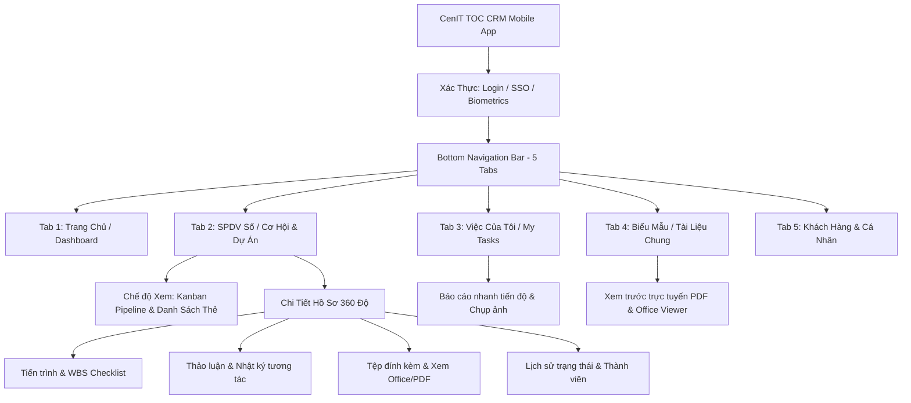
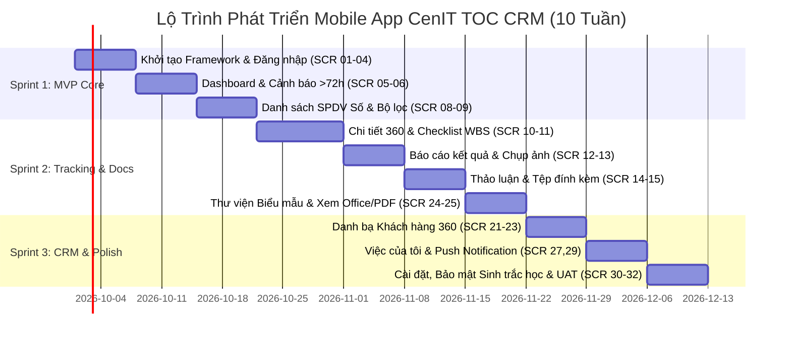

# 📱 PRODUCT BACKLOG & KIẾN TRÚC GIAO DIỆN MOBILE APP (CENIT TOC CRM)

> **Dự án:** Ứng dụng Di động Quản lý Quan hệ Khách hàng & Kinh doanh Dịch vụ Số  
> **Khách hàng / Đơn vị thụ hưởng:** VNPT Khánh Hòa – Trung Tâm Kinh Doanh Giải Pháp (TTKDGP)  
> **Tài liệu:** `backlog_mobile_app.md`  
> **Nền tảng mục tiêu:** Flutter (iOS & Android)  
> **Backend tích hợp:** ASP.NET Web API 2 (`Modules.API` / .NET Framework 4.8)  
> **Ngày lập:** 24/09/2026 — **Phiên bản:** v1.0.0  

---

## 📑 MỤC LỤC TỔNG QUAN

1. [Tầm Nhìn Sản Phẩm & Chân Dung Người Dùng (Personas)](#1-tầm-nhìn-sản-phẩm--chân-dung-người-dùng-personas)
2. [Cấu Trúc Điều Hướng Ứng Dụng (Information Architecture & App Navigation)](#2-cấu-trúc-điều-hướng-ứng-dụng-information-architecture--app-navigation)
3. [Bộ Sưu Tập Hình Ảnh Thiết Kế UI Chi Tiết (High-Fidelity Visual Gallery)](#3-bộ-sưu-tập-hình-ảnh-thiết-kế-ui-chi-tiết-high-fidelity-visual-gallery)
4. [Bảng Tổng Hợp 32 Màn Hình Mobile App Theo Phân Hệ](#4-bảng-tổng-hợp-32-màn-hình-mobile-app-theo-phân-hệ)
5. [Đặc Tả Chi Tiết 32 Màn Hình Mobile](#5-đặc-tả-chi-tiết-32-màn-hình-mobile)
   - [Nhóm 1: Xác Thực & Khởi Động (4 Màn hình)](#nhóm-1-xác-thực--khởi-động-auth--onboarding---4-màn-hình)
   - [Nhóm 2: Bảng Điều Khiển & Tổng Quan (3 Màn hình)](#nhóm-2-bảng-điều-khiển--tổng-quan-home--dashboard---3-màn-hình)
   - [Nhóm 3: Quản Lý Cơ Hội & Dự Án SPDV Số (9 Màn hình - Core)](#nhóm-3-quản-lý-cơ-hội--dự-án-spdv-số-digital-sales-core---9-màn-hình)
   - [Nhóm 4: Tạo & Chỉnh Sửa Hồ Sơ / Nhiệm Vụ (4 Màn hình)](#nhóm-4-tạo--chỉnh-sửa-hồ-sơ--nhiệm-vụ-forms--operations---4-màn-hình)
   - [Nhóm 5: Quản Lý Khách Hàng 360 Độ (3 Màn hình)](#nhóm-5-quản-lý-khách-hàng-360-độ-customer-relationship---3-màn-hình)
   - [Nhóm 6: Tài Liệu & Biểu Mẫu Dùng Chung (3 Màn hình)](#nhóm-6-tài-liệu--biểu-mẫu-dùng-chung-shared-documents---3-màn-hình)
   - [Nhóm 7: Công Việc & Nhiệm Vụ Cá Nhân (2 Màn hình)](#nhóm-7-công-việc--nhiệm-vụ-cá-nhân-my-tasks--to-do---2-màn-hình)
   - [Nhóm 8: Thông Báo, Cá Nhân & Cài Đặt (4 Màn hình)](#nhóm-8-thông-báo-cá-nhân--cài-đặt-notifications--settings---4-màn-hình)
6. [Quy Chuẩn Thiết Kế Giao Diện Di Động (Mobile Design Tokens)](#6-quy-chuẩn-thiết-kế-giao-diện-di-động-mobile-design-tokens)
7. [Lộ Trình Triển Khai Phát Triển (Release Roadmap & Sprints)](#7-lộ-trình-triển-khai-phát-triển-release-roadmap--sprints)

---

## 📸 BỘ SƯU TẬP HÌNH ẢNH THIẾT KẾ UI CHI TIẾT (HIGH-FIDELITY VISUAL GALLERY)

Toàn bộ bản vẽ thiết kế giao diện di động chất lượng cao đã được xuất và lưu trữ tại thư mục [`design_mobile/mockups/`](file:///d:/SVN/crm/design_mobile/mockups/):

| STT | Mã màn hình | Tên màn hình UI | Tệp hình ảnh thiết kế | Điểm nhấn trải nghiệm người dùng (UX Highlights) |
| :---: | :---: | :--- | :--- | :--- |
| **01** | `SCR-02` | **Đăng Nhập SSO & Sinh Trắc Học** | [`01_auth_login.jpg`](file:///d:/SVN/crm/design_mobile/mockups/01_auth_login.jpg) | Nhận diện thương hiệu VNPT Khánh Hòa, nút đăng nhập nhanh **VNPT SSO**, mở khóa 1 chạm bằng khuôn mặt **Face ID / Vân tay** với hiệu ứng vòng tròn neon công nghệ. |
| **02** | `SCR-05` | **Bảng Điều Hành Giám Đốc (KPIs)** | [`02_executive_dashboard.jpg`](file:///d:/SVN/crm/design_mobile/mockups/02_executive_dashboard.jpg) | Thẻ KPI nổi bật Doanh thu SPDV Số thực tế (12.8 Tỷ - 84.5%), **Biểu đồ Donut Chart** cơ cấu dịch vụ (Chính quyền số, Y tế, Cloud), **Băng cảnh báo đỏ khẩn cấp** các dự án trễ cập nhật quá 72h. |
| **03** | `SCR-08` | **Đường Ống Bán Hàng & Pipeline** | [`03_pipeline_kanban.jpg`](file:///d:/SVN/crm/design_mobile/mockups/03_pipeline_kanban.jpg) | Giao diện thẻ Kanban cuộn ngang trực quan theo từng giai đoạn: *Tiếp cận (12) → Khảo sát (8) → Báo giá (15) → Đã ký (7)*; gắn cờ cảnh báo đỏ cho dự án cần cập nhật, nút thêm nhanh FAB (+). |
| **04** | `SCR-10` `SCR-11` | **Chi Tiết Cơ Hội & Tiến Trình WBS** | [`04_opportunity_wbs_detail.jpg`](file:///d:/SVN/crm/design_mobile/mockups/04_opportunity_wbs_detail.jpg) | Thanh tiến trình các bước dự án phát sáng cyan, **Hạng mục công việc WBS** với checkbox chạm hoàn thành ngay trên điện thoại, thanh công cụ hiện trường: *Chụp ảnh hiện trường, Thảo luận, Báo cáo, Đổi trạng thái*. |
| **05** | `SCR-22` | **Hồ Sơ Khách Hàng 360 Độ** | [`05_customer_360_profile.jpg`](file:///d:/SVN/crm/design_mobile/mockups/05_customer_360_profile.jpg) | Thẻ tổ chức (UBND TP Nha Trang); nút hành động nhanh **Gọi điện, Gửi email công vụ, Chỉ đường bản đồ**; danh bạ người liên hệ; danh sách hợp đồng & dự án đang triển khai kèm thanh tiến độ %. |
| **06** | `SCR-25` | **Xem Trực Tiếp Hợp Đồng / Biểu Mẫu** | [`06_document_office_preview.jpg`](file:///d:/SVN/crm/design_mobile/mockups/06_document_office_preview.jpg) | Trình đọc văn bản trực tiếp tích hợp **Microsoft Office Online & PDF Viewer** trên di động mà không cần cài app phụ; xem điều khoản hợp đồng SPDV Số; hỗ trợ chuyển trang, thu phóng, **Ký số & Phê duyệt điện tử**. |

> 💡 **Khuyến nghị trải nghiệm:** Mở tệp [`design_mobile/index.html`](file:///d:/SVN/crm/design_mobile/index.html) trên trình duyệt, chọn tab **"UI Gallery"** để duyệt toàn bộ 6 bản vẽ UI ở độ phân giải gốc cực nét với hộp thoại xem chi tiết (Lightbox Modal).

---

## 1. TẦM NHÌN SẢN PHẨM & CHÂN DUNG NGƯỜI DÙNG (PERSONAS)

### 1.1. Mục tiêu chiến lược của Mobile App
Mobile App **CenIT TOC CRM** được xây dựng nhằm giải quyết bài toán "Kinh doanh di động" (Field Sales & On-site Support) của đội ngũ TTKDGP VNPT Khánh Hòa:
1. **Nắm bắt cơ hội tức thì:** AM gặp gỡ khách hàng có thể tra cứu thông tin lịch sử, tạo mới cơ hội kinh doanh ngay tại hiện trường.
2. **Báo cáo tiến độ tại chỗ (Real-time reporting):** Chụp ảnh khảo sát hiện trường, chụp biên bản nghiệm thu bằng camera điện thoại và đính kèm vào checklist công việc trong vài giây.
3. **Giám sát điều hành không gián đoạn:** Lãnh đạo Trung tâm theo dõi doanh thu thực tế, phê duyệt chuyển trạng thái cơ hội/dự án, nhận cảnh báo dự án trễ hạn (> 72h) qua Push Notification.
4. **Tra cứu tài liệu biểu mẫu nhanh chóng:** Mở xem trực tiếp biểu mẫu hợp đồng, tài liệu giải pháp kỹ thuật (PDF, Word, Excel) trên điện thoại khi đi công tác.

### 1.2. Đối tượng sử dụng chính (Personas)
- **Persona 1 — Ban Giám Đốc TTKDGP / Trưởng Phòng (Executive / Manager):** Cần xem Dashboard KPIs, doanh thu theo nhóm dịch vụ, phê duyệt dự án trọng điểm, kiểm soát tiến độ AM.
- **Persona 2 — Account Manager (AM - Kinh doanh):** Luân chuyển ngoài hiện trường; cần danh bạ khách hàng 360, danh sách cơ hội, cập nhật tương tác thảo luận, báo cáo công việc.
- **Persona 3 — Kỹ sư Giải pháp / Kỹ thuật (Pre-sales / Solution Engineer):** Phụ trách khảo sát, trình diễn giải pháp, hoàn thành các task kỹ thuật trong quy trình WBS.

---

## 2. CẤU TRÚC ĐIỀU HƯỚNG ỨNG DỤNG (INFORMATION ARCHITECTURE & APP NAVIGATION)

Ứng dụng sử dụng mô hình điều hướng kết hợp tiêu chuẩn **Bottom Navigation Bar (5 Tabs)** và **Drawer / Quick Action Sheet**:

---

## 3. BẢNG TỔNG HỢP 32 MÀN HÌNH MOBILE APP THEO PHÂN HỆ

| STT | Mã Màn Hình | Tên Màn Hình (Screen Name) | Phân Hệ / Nhóm | Cấp Độ Ưu Tiên | Mô Tả Tóm Tắt |
| :---: | :---: | :--- | :---: | :---: | :--- |
| **I** | **AUTH** | **Nhóm 1: Xác Thực & Khởi Động** | | | |
| 1 | `SCR-01` | Splash & Khởi tạo ứng dụng | Xác thực | **P0 (MVP)** | Logo VNPT Khánh Hòa, kiểm tra token, kiểm tra phiên bản app |
| 2 | `SCR-02` | Đăng nhập hệ thống (Login) | Xác thực | **P0 (MVP)** | Đăng nhập tài khoản mật khẩu, VNPT SSO, hỗ trợ Face ID / Vân tay |
| 3 | `SCR-03` | Quên mật khẩu & Khôi phục OTP | Xác thực | **P1** | Gửi mã OTP xác thực qua Email / SMS Brandname nội bộ |
| 4 | `SCR-04` | Kích hoạt Sinh trắc học & Mã PIN | Xác thực | **P1** | Đăng ký Face ID / Touch ID / PIN 6 số cho lần đăng nhập sau |
| **II** | **HOME** | **Nhóm 2: Bảng Điều Khiển & Tổng Quan** | | | |
| 5 | `SCR-05` | Trang chủ Dashboard Điều hành | Dashboard | **P0 (MVP)** | KPI doanh thu, biểu đồ tóm tắt, cơ hội mới, việc khẩn hôm nay |
| 6 | `SCR-06` | Trung tâm Cảnh báo Nhanh | Dashboard | **P0 (MVP)** | Danh sách hồ sơ chậm tương tác (> 72h), dự án trọng điểm, quan tâm |
| 7 | `SCR-07` | Báo cáo Thống kê & Phân tích Doanh thu | Dashboard | **P1** | Biểu đồ doanh thu theo nhóm dịch vụ số, phòng ban, AM, tỷ lệ chuyển đổi |
| **III** | **SALES** | **Nhóm 3: Quản Lý Cơ Hội & Dự Án SPDV Số (Core)** | | | |
| 8 | `SCR-08` | Danh sách Hồ sơ Kinh doanh (Digital Sales) | SPDV Số | **P0 (MVP)** | Chuyển đổi linh hoạt giữa Dạng Thẻ (List Card) và Bảng Kanban Pipeline |
| 9 | `SCR-09` | Bộ lọc Tìm kiếm Nâng cao (Filter Modal) | SPDV Số | **P0 (MVP)** | Lọc đa tiêu chí: Loại hình, Năm, Trạng thái đa chọn, AM, Phòng ban, Trọng điểm |
| 10 | `SCR-10` | Chi tiết Hồ sơ Cơ hội / Dự án (Chi tiết 360°) | SPDV Số | **P0 (MVP)** | Header trạng thái, doanh thu, thanh tiến độ và thanh tab chuyển phân hệ |
| 11 | `SCR-11` | Cây Tiến trình & Checklist Công việc (WBS) | SPDV Số | **P0 (MVP)** | Danh sách cây 3 cấp: Tiến trình -> Công việc -> Việc con; toggle xong/chưa |
| 12 | `SCR-12` | Báo cáo Kết quả Thực hiện Công việc | SPDV Số | **P0 (MVP)** | Ghi kết quả, chụp ảnh hiện trường, đính kèm biên bản kiểm chứng |
| 13 | `SCR-13` | Lịch sử Thao tác & Nhật ký Tiến trình (Logs) | SPDV Số | **P1** | Lịch sử thay đổi tiến trình/task, người báo cáo, thời gian, chi tiết file |
| 14 | `SCR-14` | Thảo luận & Nhật ký Tương tác (Discussions) | SPDV Số | **P0 (MVP)** | Khung chat tương tác, gửi bình luận, đính kèm tệp, @mention đồng nghiệp |
| 15 | `SCR-15` | Quản lý Tệp Đính kèm Hồ sơ (Attachments) | SPDV Số | **P0 (MVP)** | Danh sách tệp, thumbnail ảnh, xem trước trực tiếp PDF & Office Online |
| 16 | `SCR-16` | Chuyển Trạng thái Hồ sơ & Đổi Quy trình | SPDV Số | **P0 (MVP)** | Chuyển Cơ hội sang Dự án, đổi trạng thái, chọn quy trình chuẩn |
| **IV** | **FORMS** | **Nhóm 4: Tạo & Chỉnh Sửa Hồ Sơ / Nhiệm Vụ** | | | |
| 17 | `SCR-17` | Thêm mới Hồ sơ Cơ hội / Dự án | Nhập liệu | **P0 (MVP)** | Nhập tên dự án, chọn khách hàng, AM chủ trì, giá trị dự kiến, hạn chót |
| 18 | `SCR-18` | Chỉnh sửa Thông tin Hồ sơ | Nhập liệu | **P1** | Cập nhật thông tin chung, nhóm dịch vụ, doanh thu ký hợp đồng |
| 19 | `SCR-19` | Thêm mới / Sửa Công việc & Việc con (Task Form) | Nhập liệu | **P0 (MVP)** | Form bottom-sheet tạo task/subtask, gán người làm, chọn ngày bắt đầu/kết thúc |
| 20 | `SCR-20` | Quản lý Thành viên Hồ sơ (Team Members) | Nhập liệu | **P1** | Thêm bớt AM hỗ trợ, kỹ thuật viên giải pháp, phân công người theo dõi |
| **V** | **CRM** | **Nhóm 5: Quản Lý Khách Hàng 360 Độ** | | | |
| 21 | `SCR-21` | Danh bạ Khách hàng Doanh nghiệp / Tổ chức | Khách hàng | **P0 (MVP)** | Danh sách khách hàng, tìm theo MST, tên đơn vị, gọi điện/email nhanh |
| 22 | `SCR-22` | Hồ sơ Khách hàng 360 Độ | Khách hàng | **P1** | Thông tin doanh nghiệp, đại diện liên hệ, bản đồ chỉ đường, lịch sử dự án đã ký |
| 23 | `SCR-23` | Thêm mới / Cập nhật Khách hàng | Khách hàng | **P1** | Đăng ký khách hàng mới ngay khi đi thị trường, tra cứu mã số thuế tự động |
| **VI** | **DOCS** | **Nhóm 6: Tài Liệu & Biểu Mẫu Dùng Chung** | | | |
| 24 | `SCR-24` | Thư viện Biểu mẫu & Tài liệu Chung | Tài liệu | **P0 (MVP)** | Chuyên mục Hợp đồng, Quy trình ISO, Kỹ thuật, Hành chính; tìm kiếm nhanh |
| 25 | `SCR-25` | Trình Xem Trước Tài liệu (Document Viewer) | Tài liệu | **P0 (MVP)** | Xem trực tiếp PDF gốc hoặc nhúng Microsoft Office Online xem Word/Excel |
| 26 | `SCR-26` | Đăng tải Tài liệu Biểu mẫu Mới | Tài liệu | **P2** | Chọn chuyên mục tài liệu, nhập tên mẫu, chọn tệp từ bộ nhớ điện thoại |
| **VII** | **TASKS** | **Nhóm 7: Công Việc & Nhiệm Vụ Cá Nhân** | | | |
| 27 | `SCR-27` | Danh sách Nhiệm vụ Của Tôi (My Tasks) | Công việc | **P0 (MVP)** | Phân loại: Việc hôm nay, Quá hạn, Tuần này; vuốt ngang để báo cáo kết quả |
| 28 | `SCR-28` | Lịch Công tác & Hạn chót (Work Calendar) | Công việc | **P2** | Lịch trực quan theo ngày/tháng hiển thị các deadline công việc và cuộc hẹn |
| **VIII** | **USER** | **Nhóm 8: Thông Báo, Cá Nhân & Cài Đặt** | | | |
| 29 | `SCR-29` | Trung tâm Thông báo (Notifications Center) | Hệ thống | **P0 (MVP)** | Cảnh báo > 72h, thông báo được giao việc mới, tương tác bình luận, đổi trạng thái |
| 30 | `SCR-30` | Hồ sơ Cá nhân (Profile) | Hệ thống | **P1** | Thông tin nhân viên, chức vụ, đơn vị, chữ ký cá nhân, thống kê số dự án |
| 31 | `SCR-31` | Cài đặt Ứng dụng & Giao diện | Hệ thống | **P2** | Đổi chủ đề Sáng / Tối (Dark Mode), bật tắt âm thanh, cấu hình cache ngoại tuyến |
| 32 | `SCR-32` | Trợ giúp & Thông tin Phiên bản | Hệ thống | **P2** | Hướng dẫn sử dụng nhanh, liên hệ hỗ trợ kỹ thuật TTKDGP, bản quyền |

---

## 4. ĐẶC TẢ CHI TIẾT 32 MÀN HÌNH MOBILE

### Nhóm 1: Xác Thực & Khởi Động (Auth & Onboarding - 4 Màn hình)

#### `SCR-01`: Splash Screen & Khởi Tạo Ứng Dụng
- **Mục tiêu:** Màn hình chào mừng khi bật ứng dụng, kiểm tra trạng thái token lưu trữ cục bộ (`SecureStorage`), kiểm tra phiên bản cập nhật.
- **Thành phần UI:**
  - Logo VNPT Khánh Hòa chính giữa với hiệu ứng nhận diện thương hiệu.
  - Spinner tải nhẹ nhàng (`CircularProgressIndicator`).
  - Dòng chữ bản quyền: *"CenIT TOC CRM – Trung Tâm Kinh Doanh Giải Pháp VNPT Khánh Hòa"*.
- **Tác vụ & Logic:**
  - Nếu Token còn hạn (`Valid JWT Token`): Tự động điều hướng vào `SCR-05` (Trang chủ) hoặc yêu cầu Face ID nếu đã bật.
  - Nếu Token hết hạn hoặc chưa đăng nhập: Điều hướng sang `SCR-02` (Đăng nhập).

#### `SCR-02`: Đăng Nhập Hệ Thống (Login Screen)
- **Mục tiêu:** Cho phép người dùng truy cập hệ thống bảo mật bằng nhiều phương thức.
- **Thành phần UI:**
  - Tiêu đề thương hiệu: *"Hệ thống Quản lý Khách hàng & SPDV Số"*.
  - Ô nhập: Tên đăng nhập / Email VNPT.
  - Ô nhập: Mật khẩu (kèm icon ẩn/hiện mật khẩu).
  - Nút chính: *"Đăng nhập"* (Màu xanh VNPT Blue `#0066cc`).
  - Nút đăng nhập phụ: *"Đăng nhập qua VNPT SSO"* (Tích hợp tài khoản tập đoàn).
  - Nút biểu tượng Face ID / Vân tay (nếu thiết bị đã cấu hình).
  - Liên kết: *"Quên mật khẩu?"*.
- **API Endpoint:** `POST /api/auth/login`, `POST /api/auth/sso-login`.

#### `SCR-03`: Quên Mật Khẩu & Khôi Phục Tài Khoản
- **Mục tiêu:** Cung cấp quy trình tự khôi phục mật khẩu thông qua email nội bộ hoặc số điện thoại đăng ký.
- **Thành phần UI:** Ô nhập Email/SĐT, nút *"Gửi mã xác thực OTP"*, ô nhập mã OTP 6 số, ô nhập mật khẩu mới và xác nhận mật khẩu.
- **API Endpoint:** `POST /api/auth/forgot-password`, `POST /api/auth/verify-otp`.

#### `SCR-04`: Kích Hoạt Sinh Trắc Học & Mã PIN Bảo Mật
- **Mục tiêu:** Cấu hình bảo mật vân tay / Face ID / PIN code cho các lần mở ứng dụng tiếp theo mà không cần gõ lại mật khẩu dài.
- **Thành phần UI:** Hình minh họa Face ID / Vân tay, nút kích hoạt ngay, tùy chọn thiết lập mã PIN 6 số.

---

### Nhóm 2: Bảng Điều Khiển & Tổng Quan (Home & Dashboard - 3 Màn hình)

#### `SCR-05`: Trang Chủ Dashboard Điều Hành (Home Executive Dashboard)
- **Mục tiêu:** Cung cấp cái nhìn toàn cảnh về tình hình kinh doanh trong ngày/tháng cho lãnh đạo và AM.
- **Thành phần UI:**
  - **Header di động:** Lời chào nhân sự (Avatar, *"Chào buổi sáng, [Tên nhân viên]"*), icon Quả chuông thông báo (kèm badge đỏ số tin chưa đọc), icon Tìm kiếm nhanh toàn cục.
  - **Khối Thống kê KPIs (Scroll ngang):**
    + *Doanh thu thực tế (Đã ký):* Card màu xanh ngọc bích, số tiền (VD: `3.250 Tr.đ`), tỷ lệ đạt kế hoạch.
    + *Doanh thu dự kiến (Pipeline):* Card màu xanh dương, số tiền cơ hội đang theo đuổi (VD: `8.400 Tr.đ`).
    + *Tổng Cơ hội / Dự án:* Số lượng hồ sơ đang active.
    + *Tỷ lệ chuyển đổi thành công:* Phần trăm chốt đơn.
  - **Thanh Tác Vụ Nhanh (Quick Actions Grid 4 ô):**
    + `+ Cơ hội mới` (Mở `SCR-17`).
    + `Cảnh báo > 72h` (Mở `SCR-06`).
    + `Việc của tôi` (Mở `SCR-27`).
    + `Biểu mẫu chung` (Mở `SCR-24`).
  - **Widget Cảnh Báo Khẩn:** Banner cảnh báo hồ sơ quá 72 giờ chưa tương tác (nền vàng cam).
  - **Widget Việc Cần Làm Hôm Nay (Top 3 nhiệm vụ):** Tên việc, tên hồ sơ, hạn chót giờ hoàn thành, nút chạm báo cáo nhanh.

#### `SCR-06`: Trung Tâm Cảnh Báo Nhanh (Smart Alerts Hub)
- **Mục tiêu:** Giúp AM và lãnh đạo xử lý tức thì các điểm nghẽn trong bán hàng.
- **Thành phần UI:**
  - 3 Tab phân loại:
    1. *Chậm tương tác (> 72h):* Liệt kê các cơ hội có ngày cập nhật gần nhất quá 3 ngày. Kèm nút bấm nhanh: *"Gọi điện"*, *"Ghi nhật ký thảo luận"*.
    2. *Dự án Trọng điểm (`IsKeyProject`):* Các dự án chiến lược của trung tâm cần tập trung nguồn lực.
    3. *Hồ sơ Đang quan tâm (`IsFollowed`):* Danh sách các hồ sơ mà user đã đánh dấu ngôi sao theo dõi.

#### `SCR-07`: Báo Cáo Thống Kê & Phân Tích Doanh Thu
- **Mục tiêu:** Trực quan hóa dữ liệu kinh doanh phục vụ giao ban và đánh giá kết quả.
- **Thành phần UI:**
  - Bộ chọn thời gian: Tháng này, Quý này, Năm nay.
  - Biểu đồ hình tròn (Donut Chart): Phân bổ doanh thu theo Nhóm dịch vụ số (Chính quyền số, Y tế số, Giáo dục số, Doanh nghiệp...).
  - Biểu đồ cột (Bar Chart): So sánh doanh thu kế hoạch vs thực tế theo từng AM / Phòng ban.
  - Bảng tổng kết Top 5 cơ hội có giá trị hợp đồng lớn nhất.

---

### Nhóm 3: Quản Lý Cơ Hội & Dự Án SPDV Số (Digital Sales Core - 9 Màn hình)

#### `SCR-08`: Danh Sách Hồ Sơ Kinh Doanh (Digital Sales Master View)
- **Mục tiêu:** Màn hình trung tâm quản lý toàn bộ cơ hội và dự án dịch vụ số.
- **Thành phần UI:**
  - Thanh tìm kiếm từ khóa (Mã hồ sơ, Tên dự án, Tên khách hàng).
  - Nút chuyển đổi giao diện (Toggle View Button):
    + **Chế độ Thẻ (List View):** Hiển thị danh sách dọc các thẻ cơ hội. Mỗi thẻ gồm: Tên cơ hội, Icon Loại hình (Cơ hội / Dự án), Badge trạng thái (Tiếp cận, Hình thành, Triển khai, Ký HĐ...), AM phụ trách, Doanh thu dự kiến, Star icon (đánh dấu theo dõi).
    + **Chế độ Pipeline Kanban:** Kéo trượt ngang qua các cột trạng thái tương tự Trello/Jira mobile; cho phép chạm giữ và kéo thẻ sang cột trạng thái mới.
  - Nút nổi (Floating Action Button - FAB): Nút tròn màu xanh dấu `+` để thêm mới hồ sơ bất kỳ lúc nào.
  - Nút mở bộ lọc (Filter Icon kèm chấm đỏ khi đang có bộ lọc active).

#### `SCR-09`: Bộ Lọc Tìm Kiếm Nâng Cao (Advanced Filter Sheet)
- **Mục tiêu:** Lọc chính xác hồ sơ theo nhu cầu thực tế trên mobile.
- **Thành phần UI (Bottom Sheet mở từ đáy lên):**
  - Loại hình: Tất cả / Cơ hội kinh doanh / Dự án CNTT.
  - Năm áp dụng: Năm hiện tại (2026), 2025, 2024.
  - Nhóm trạng thái (Multi-select Chips): Chưa nắm bắt, Tiếp cận, Hình thành, Triển khai, Hợp đồng, Hoàn thành, Bỏ/Mất.
  - Phòng ban / Nhóm giải pháp: Dropdown danh sách phòng ban.
  - AM chủ trì: Dropdown chọn nhân sự.
  - Checkbox công tắc: *"Chỉ xem dự án trọng điểm"* & *"Chỉ xem hồ sơ tôi đang theo dõi"*.
  - 2 Nút cuối: *"Đặt lại"* và *"Áp dụng bộ lọc"*.

#### `SCR-10`: Chi Tiết Hồ Sơ Cơ Hội / Dự Án (360° Profile View)
- **Mục tiêu:** Trung tâm thông tin đầy đủ nhất về một hồ sơ kinh doanh.
- **Thành phần UI:**
  - **Header cố định:** Mã hồ sơ (VD: `CH-2026-089`), Tên dự án, Tên khách hàng (bấm vào mở gọi điện), Nút ngôi sao theo dõi (`ToggleFollow`), Nút ba chấm thao tác nhanh (Chuyển trạng thái, Sửa, Chia sẻ).
  - **Thẻ Tóm tắt Tài chính:** Doanh thu dự kiến vs Doanh thu hợp đồng, Tỷ lệ tiến độ tổng thể (% thanh tiến trình gradient).
  - **Hệ thống 5 Tabs chuyển đổi mượt mà:**
    1. *Tab 1: Tiến trình & Checklist công việc* (Dẫn vào `SCR-11`).
    2. *Tab 2: Thảo luận & Nhật ký* (Dẫn vào `SCR-14`).
    3. *Tab 3: Tệp đính kèm* (Dẫn vào `SCR-15`).
    4. *Tab 4: Thành viên tham gia* (Dẫn vào `SCR-20`).
    5. *Tab 5: Lịch sử trạng thái* (Timeline các mốc chuyển đổi hồ sơ).

#### `SCR-11`: Cây Tiến Trình & Checklist Công Việc (WBS Checklist Tree)
- **Mục tiêu:** Quản trị các bước triển khai của hồ sơ theo cấu trúc phân cấp chuẩn hóa.
- **Thành phần UI:**
  - Cây danh mục phân cấp 3 tầng hiển thị rõ ràng:
    + **Cấp 1 - Tiến trình (Progress):** Khảo sát, Trình diễn giải pháp, Lập dự toán, Đấu thầu... Kèm % hoàn thành của tiến trình.
    + **Cấp 2 - Công việc (Task):** Checkbox đánh dấu hoàn thành, Tên việc, Avatar người phụ trách, Hạn chót (Badge đỏ nếu quá hạn).
    + **Cấp 3 - Công việc con (Subtask):** Đầu việc chi tiết lùi đầu dòng, hỗ trợ cấu trúc WBS `1.1, 1.2`.
  - Nút thao tác nhanh trên mỗi dòng:
    + Nút *"Báo cáo kết quả"* (Mở `SCR-12`).
    + Nút menu ba chấm `...`: Xem log lịch sử (`SCR-13`), Chỉnh sửa (`SCR-19`), Thêm việc con, Xóa việc.

#### `SCR-12`: Màn Hình Báo Cáo Kết Quả Thực Hiện Công Việc (Report Sheet)
- **Mục tiêu:** Cho phép nhân sự tại hiện trường nộp báo cáo kết quả đầu việc ngay trên điện thoại (đáp ứng đúng nghiệp vụ US-01).
- **Thành phần UI:**
  - Thông tin chỉ đọc: Tên đầu việc, Người phụ trách, Hạn chót.
  - Ô nhập: *Nội dung báo cáo kết quả thực hiện* (TextArea hỗ trợ nhập giọng nói qua bàn phím điện thoại).
  - Khối Upload tài liệu & Hình ảnh minh chứng:
    + Nút *"Chụp ảnh từ Camera"* (Mở trực tiếp máy ảnh chụp hiện trường, biên bản ký nhận).
    + Nút *"Chọn tệp từ máy"* (PDF, Word, Excel, Ảnh).
    + Danh sách thumbnail các file vừa đính kèm (cho phép bấm xem trước hoặc xóa).
  - Danh sách các tệp và báo cáo đã nộp trước đó (lịch sử báo cáo tích lũy).
  - Nút bấm: *"Gửi báo cáo ngay"*.

#### `SCR-13`: Lịch Sử Thao Tác & Nhật Ký Tiến Trình (Tracking Logs)
- **Mục tiêu:** Minh bạch hóa toàn bộ các lần báo cáo và chỉnh sửa đầu việc.
- **Thành phần UI:**
  - Timeline dạng dòng thời gian: Người thực hiện, Thời gian (`10:30 - 24/09/2026`), Hành động (*"Báo cáo kết quả"* / *"Chỉnh sửa thông tin"*).
  - Nội dung thay đổi chi tiết: Lời ghi chú kết quả, danh sách tệp đính kèm kèm link xem trực tiếp.

#### `SCR-14`: Thảo Luận & Nhật Ký Tương Tác Thời Gian Thực (Discussions & Comments)
- **Mục tiêu:** Kênh giao tiếp nội bộ giữa AM, kỹ sư giải pháp và lãnh đạo ngay trong ngữ cảnh hồ sơ.
- **Thành phần UI:**
  - Giao diện dạng Chat tương tác: Bong bóng tin nhắn bên trái/phải, Avatar người gửi, Thời gian gửi.
  - Hỗ trợ hiển thị tệp đính kèm phong phú: Thẻ tài liệu PDF, Word, Excel (kèm icon và màu sắc nhận diện chuẩn), hình ảnh xem trực tiếp.
  - Thanh nhập tin nhắn ở đáy màn hình:
    + Nút icon Đính kèm tệp / Chụp ảnh.
    + Nút `@`: Gợi ý danh sách thành viên hồ sơ để mention.
    + Ô nhập nội dung thảo luận.
    + Nút Gửi (Mũi tên xanh).

#### `SCR-15`: Quản Lý Tệp Đính Kèm Hồ Sơ (Attachments Grid)
- **Mục tiêu:** Tập hợp toàn bộ tài liệu của hồ sơ từ tất cả các nguồn (đính kèm chung, checklist, thảo luận, lịch sử trạng thái).
- **Thành phần UI:**
  - Bộ lọc tệp: Tất cả / Hình ảnh / PDF / Word & Excel.
  - Lưới hiển thị 2 cột: Thumbnail xem trước, Tên tệp, Dung lượng, Nguồn gốc (Từ Checklist, Từ Thảo luận, Hồ sơ chung).
  - Tác vụ trên tệp: Bấm chạm để **Xem trước trực tuyến** (`SCR-25`), Tải về máy, Chia sẻ file qua Zalo / Email / AirDrop.

#### `SCR-16`: Chuyển Trạng Thái Hồ Sơ & Đổi Quy Trình (Status Transition Form)
- **Mục tiêu:** Thực hiện bước chuyển dịch giai đoạn bán hàng và áp dụng quy trình chuẩn.
- **Thành phần UI:**
  - Trạng thái hiện tại: Badge màu hiển thị rõ ràng.
  - Dropdown chọn Trạng thái mới.
  - Tùy chọn chuyển đổi đặc biệt: Checkbox *"Chuyển đổi thành công từ Cơ hội sang Dự án"* (khi ký hợp đồng).
  - Chọn Quy trình triển khai áp dụng mới.
  - Ô nhập: Ghi chú / Lý do chuyển trạng thái.
  - Tệp đính kèm quyết định / tờ trình / hợp đồng.
  - Nút bấm: *"Xác nhận chuyển trạng thái"*.

---

### Nhóm 4: Tạo & Chỉnh Sửa Hồ Sơ / Nhiệm Vụ (Forms & Operations - 4 Màn hình)

#### `SCR-17`: Thêm Mới Hồ Sơ Cơ Hội / Dự Án (Create Opportunity Wizard)
- **Mục tiêu:** Khởi tạo hồ sơ kinh doanh nhanh chóng khi vừa gặp khách hàng.
- **Thành phần UI:**
  - Bước 1 - Thông tin cốt lõi: Tên cơ hội kinh doanh, Chọn Khách hàng (từ danh bạ hoặc tạo nhanh), AM chủ trì.
  - Bước 2 - Dự toán kinh doanh: Giá trị doanh thu dự kiến (VNĐ), Nhóm dịch vụ số (Smart City, Y tế, Giáo dục...).
  - Bước 3 - Thời hạn & Quy trình: Ngày bắt đầu, Hạn hoàn thành dự kiến, Chọn Quy trình tiến trình mẫu ban đầu.
  - Nút bấm: *"Tạo hồ sơ"*.

#### `SCR-18`: Chỉnh Sửa Thông Tin Hồ Sơ (Edit Sales Form)
- **Mục tiêu:** Cập nhật thông tin chi tiết hồ sơ khi có thay đổi trong quá trình thương thảo.
- **Thành phần UI:** Form cuộn đầy đủ các trường thông tin chung, giá trị hợp đồng thực tế, tình trạng triển khai.

#### `SCR-19`: Thêm Mới / Sửa Công Việc & Việc Con (Task / Subtask Bottom-sheet Form)
- **Mục tiêu:** Thêm đầu việc mới vào quy trình hoặc phân rã việc con (Subtask).
- **Thành phần UI:**
  - Ô nhập: Tên công việc / việc con (*).
  - Chọn Người chịu trách nhiệm chính (Assignee).
  - Chọn Ngày bắt đầu và Ngày hoàn thành (kèm validator: Ngày hoàn thành `>=` Ngày bắt đầu).
  - Ô nhập: Trọng số / Ưu tiên (Cao, Trung bình, Thấp).
  - Đính kèm file mô tả yêu cầu.

#### `SCR-20`: Quản Lý Thành Viên Hồ Sơ (Team Assignment)
- **Mục tiêu:** Phân quyền và gắn kết các nhân sự cùng tham gia triển khai hồ sơ.
- **Thành phần UI:** Danh sách thành viên hiện tại kèm vai trò (Chủ trì, Kỹ thuật hỗ trợ, Người theo dõi); nút *"Thêm thành viên mới"*.

---

### Nhóm 5: Quản Lý Khách Hàng 360 Độ (Customer Relationship - 3 Màn hình)

#### `SCR-21`: Danh Bạ Khách Hàng (Customer Directory)
- **Mục tiêu:** Danh bạ số toàn bộ đối tác, cơ quan, doanh nghiệp tại địa bàn Khánh Hòa.
- **Thành phần UI:**
  - Thanh tìm kiếm thông minh: Tìm theo Tên doanh nghiệp, Mã số thuế, Tên người đại diện.
  - Bộ lọc theo Nhóm khách hàng: Khối Chính quyền / Doanh nghiệp / Y tế / Giáo dục.
  - Thẻ khách hàng: Tên cơ quan, Địa chỉ, Mã số thuế, Nút bấm nhanh gọi điện (`Call`) và mở bản đồ dẫn đường (`Google Maps`).

#### `SCR-22`: Chi Tiết Khách Hàng 360 Độ (Customer 360° Profile)
- **Mục tiêu:** Nắm bắt toàn bộ lịch sử hợp tác và cơ hội tiềm năng của một khách hàng.
- **Thành phần UI:**
  - Thông tin chung: Người đại diện pháp luật, số hotline, email liên hệ, địa chỉ trụ sở.
  - Lịch sử dự án: Danh sách toàn bộ các Cơ hội và Hợp đồng đã từng ký kết với VNPT kèm tổng doanh thu tích lũy.
  - Danh sách đầu mối liên hệ (Contacts): Các chuyên viên / cán bộ đầu mối của khách hàng.

#### `SCR-23`: Thêm Mới / Cập Nhật Khách Hàng (Customer Form)
- **Mục tiêu:** Tạo mới hồ sơ khách hàng ngay tại hiện trường.
- **Thành phần UI:** Form nhập Tên đơn vị, Mã số thuế, Địa chỉ, Người đại diện, Số điện thoại liên lạc.

---

### Nhóm 6: Tài Liệu & Biểu Mẫu Dùng Chung (Shared Documents - 3 Màn hình)

#### `SCR-24`: Thư Viện Biểu Mẫu & Tài Liệu Dùng Chung (Shared Documents Hub)
- **Mục tiêu:** Kho tài nguyên biểu mẫu và tài liệu chuẩn của VNPT phục vụ kinh doanh lưu động.
- **Thành phần UI:**
  - Thanh tìm kiếm tên tài liệu biểu mẫu.
  - Danh mục Chuyên mục (Horizontal Chips / Grid 4 ô lớn):
    1. 📄 *Biểu mẫu Hợp đồng*
    2. 📋 *Quy trình ISO*
    3. 🛠 *Tài liệu Kỹ thuật & Giải pháp*
    4. 📑 *Mẫu biểu Hành chính*
  - Danh sách tài liệu biểu mẫu: Tên file, Dung lượng, Định dạng icon (.doc, .xls, .pdf), Lượt tải, Ngày cập nhật.
  - Nút tác vụ: Nút *"Xem trước"* (Con mắt) và nút *"Tải về"* (Download).

#### `SCR-25`: Trình Xem Trước Tài Liệu Di Động (Document Viewer Screen)
- **Mục tiêu:** Xem trực tiếp nội dung tài liệu ngay trong ứng dụng mà không cần cài thêm phần mềm đọc file bên thứ ba.
- **Thành phần UI & Kỹ thuật:**
  - **Tệp PDF:** Tích hợp bộ đọc PDF Native (`flutter_pdfview` / Native Canvas) cho trải nghiệm cuộn mượt mà, phóng to/thu nhỏ, tìm kiếm từ khóa trong trang.
  - **Tệp Word (.doc, .docx), Excel (.xls, .xlsx), PowerPoint:** Tích hợp WebView mở trực tuyến qua dịch vụ **Microsoft Office Online Viewer** (`https://view.officeapps.live.com/op/view.aspx?src=...`).
  - Thanh công cụ trên cùng: Tên file, nút Chia sẻ (`Share Sheet`), nút Tải file về bộ nhớ máy, nút Đóng (`X`).

#### `SCR-26`: Đăng Tải Tài Liệu Biểu Mẫu Mới (Upload Document Sheet)
- **Mục tiêu:** Cho phép người dùng có quyền quản trị tải biểu mẫu mới lên kho dùng chung.
- **Thành phần UI:** Nhập tên tài liệu, chọn Chuyên mục tài liệu (4 chuyên mục từ `Sys_DocumentCategory`), nhập mô tả sử dụng, chọn tệp từ máy.

---

### Nhóm 7: Công Việc & Nhiệm Vụ Cá Nhân (My Tasks & To-Do - 2 Màn hình)

#### `SCR-27`: Danh Sách Nhiệm Vụ Của Tôi (My Tasks & Action List)
- **Mục tiêu:** Trợ lý ảo công việc hằng ngày cho từng nhân sự AM/Kỹ thuật.
- **Thành phần UI:**
  - Phân loại tab thông minh:
    + 🔴 *Quá hạn:* Việc bị trễ deadline cần xử lý ngay.
    + 🟡 *Hôm nay:* Các đầu việc có hạn chót trong ngày.
    + 🔵 *Tuần này:* Kế hoạch công việc sắp tới.
    + 🟢 *Đã xong:* Lịch sử việc đã hoàn thành.
  - Thao tác vuốt (Swipe Action):
    + Vuốt sang phải: *"Báo cáo nhanh kết quả"* (Mở `SCR-12`).
    + Vuốt sang trái: *"Đánh dấu hoàn thành"*.

#### `SCR-28`: Lịch Công Tác & Deadline (Work Calendar View)
- **Mục tiêu:** Trực quan hóa các mốc thời gian gặp khách hàng, hạn nộp báo giá, ngày mở thầu.
- **Thành phần UI:** Lịch tháng / tuần (Calendar Strip), chấm tròn màu sắc hiển thị mật độ công việc, danh sách chi tiết các sự kiện trong ngày đã chọn.

---

### Nhóm 8: Thông Báo, Cá Nhân & Cài Đặt (Notifications & Settings - 4 Màn hình)

#### `SCR-29`: Trung Tâm Thông Báo (Push Notifications Center)
- **Mục tiêu:** Cập nhật mọi biến động liên quan đến hồ sơ và công việc theo thời gian thực.
- **Thành phần UI:**
  - Bộ lọc: Tất cả / Chưa đọc.
  - Danh sách thông báo:
    + Icon cảnh báo đỏ: *Hồ sơ [Tên dự án] quá 72h chưa cập nhật tương tác*.
    + Icon công việc xanh: *Bạn được phân công nhiệm vụ [Tên việc] trong dự án [Tên dự án]*.
    + Icon thảo luận tím: *[Đồng nghiệp] vừa nhắc đến bạn trong một thảo luận*.
  - Chạm vào thông báo: Tự động điều hướng sâu (Deep Link) trực tiếp vào đúng hồ sơ hoặc đầu việc tương ứng.

#### `SCR-30`: Hồ Sơ Cá Nhân (User Profile)
- **Mục tiêu:** Quản lý thông tin tài khoản nhân sự.
- **Thành phần UI:** Ảnh đại diện (cho phép chụp đổi avatar), Họ và tên, Chức vụ, Phòng ban trực thuộc, Email VNPT, Số máy lẻ, Thống kê cá nhân (Số cơ hội đang chủ trì, Doanh thu đã mang lại).

#### `SCR-31`: Cài Đặt Ứng Dụng (App Settings)
- **Mục tiêu:** Cá nhân hóa trải nghiệm sử dụng.
- **Thành phần UI:**
  - Chế độ giao diện: Sáng (Light Mode) / Tối (Dark Mode) / Tự động theo hệ điều hành.
  - Cài đặt bảo mật: Bật/Tắt Face ID & Touch ID, đổi mã PIN.
  - Cài đặt thông báo: Bật/Tắt chuông báo đẩy, lọc loại thông báo nhận.
  - Quản lý bộ nhớ đệm: Dung lượng cache tài liệu tạm, nút *"Xóa bộ nhớ đệm"*.
  - Nút: *"Đăng xuất"* (Nổi bật màu đỏ).

#### `SCR-32`: Trợ Giúp, Hướng Dẫn & Thông Tin Phiên Bản (About & Support)
- **Mục tiêu:** Cung cấp kênh trợ giúp kỹ thuật và pháp lý ứng dụng.
- **Thành phần UI:** Hướng dẫn sử dụng phím tắt, Số hotline kỹ thuật TTKDGP, Phiên bản app (`v1.0.0 Build 20260924`), Chính sách bảo mật dữ liệu nội bộ VNPT.

---

## 5. QUY CHUẨN THIẾT KẾ GIAO DIỆN DI ĐỘNG (MOBILE DESIGN TOKENS)

Hệ thống giao diện mobile kế thừa bản sắc thương hiệu VNPT kết hợp ngôn ngữ thiết kế hiện đại (Modern Flat & Glassmorphism):

### 5.1. Bảng màu thương hiệu (Color Palette)
- **Primary Color (VNPT Blue):** `#0066cc` (Độ tương phản cao, chuyên nghiệp, uy tín).
- **Primary Dark (Header / App Bar):** `#004c99`.
- **Secondary Accent:** `#00a3e0` (Cyan hiện đại tạo điểm nhấn).
- **Trạng thái kinh doanh (Status Colors):**
  - *Tiếp cận / Khởi tạo:* Nền `#e0f2fe`, Chữ `#0284c7`.
  - *Hình thành giải pháp:* Nền `#f3e8ff`, Chữ `#7c3aed`.
  - *Triển khai / Dự án:* Nền `#dbeafe`, Chữ `#1d4ed8`.
  - *Hợp đồng thành công:* Nền `#dcfce7`, Chữ `#15803d` (Green).
  - *Mất / Thất bại:* Nền `#fee2e2`, Chữ `#dc2626` (Red).
  - *Trọng điểm / Sao vàng:* Nền `#fef3c7`, Chữ `#b45309` (Amber).
- **Background & Surface:**
  - Light Theme: `#f8fafc` (Background), `#ffffff` (Card Surface).
  - Dark Theme: `#0f172a` (Background), `#1e293b` (Card Surface).

### 5.2. Kích thước & Khoảng cách (Dimens & Touch Targets)
- **Vùng chạm tối thiểu (Touch Target):** `>= 48dp x 48dp` (Đáp ứng chuẩn kiểm thử di động của Google Material & Apple HIG, chống bấm nhầm khi đi đường).
- **Bo góc chuẩn (Corner Radius):**
  - Thẻ Card: `12dp` hoặc `16dp` tạo cảm giác mềm mại cao cấp.
  - Nút bấm (Buttons): `10dp` hoặc viên thuốc `24dp` (Pill Button).
  - Bottom Sheet Modal: Bo tròn 2 góc trên `20dp`.
- **Hệ lưới khoảng cách (Spacing Grid):** Bội số của `4dp` (`4, 8, 12, 16, 20, 24, 32dp`).

---

## 6. LỘ TRÌNH TRIỂN KHAI PHÁT TRIỂN (RELEASE ROADMAP & SPRINTS)

Kế hoạch xây dựng ứng dụng di động được phân chia thành **3 Giai đoạn (Sprints)** để nhanh chóng đưa sản phẩm vào kiểm thử thực tế:

- **Giai đoạn 1 (Sprint 1 - 3 tuần) — CỐT LÕI KINH DOANH (MVP):** Hoàn thành Đăng nhập, Dashboard điều hành, Danh sách cơ hội kinh doanh dạng Thẻ & Kanban, Bộ lọc nâng cao.
- **Giai đoạn 2 (Sprint 2 - 4 tuần) — TIẾN TRÌNH & TÀI LIỆU:** Hoàn thành Chi tiết hồ sơ 360°, Cây checklist WBS, Màn hình báo cáo chụp ảnh hiện trường, Thảo luận Chat, Thư viện biểu mẫu chung và Trình xem PDF/Office Online.
- **Giai đoạn 3 (Sprint 3 - 3 tuần) — KHÁCH HÀNG & HOÀN THIỆN:** Danh bạ Khách hàng 360°, Nhiệm vụ cá nhân My Tasks, Push Notifications thời gian thực, Tối ưu hiệu năng và phát hành thử nghiệm nội bộ.
